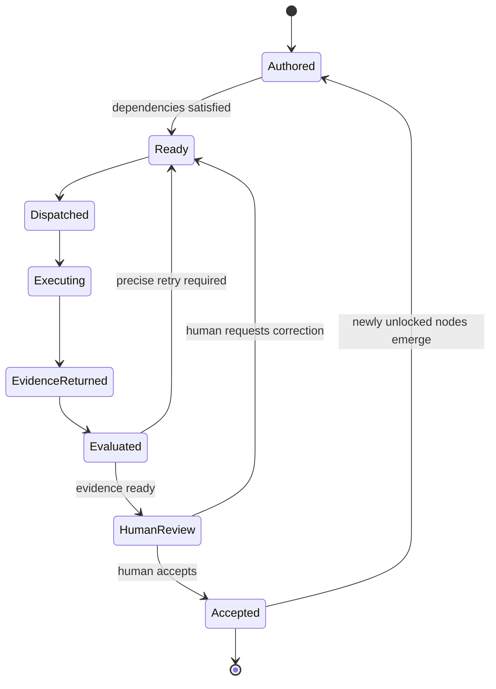
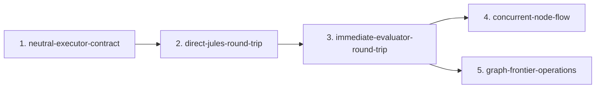

# GDDP - Project Brief

GDDP makes small, bounded project nodes economically viable and moves many of
them quickly without losing user intent, project integrity, auditability, or
human control.

## Purpose

GDDP is the intent-preservation and graph-integrity layer around agentic work.
It turns a project into an explicit graph, determines which nodes are ready,
observes implementation attempts, evaluates returned evidence, and presents the
human with precise review decisions. It does not make an executor authoritative
and it does not silently convert successful execution into project truth.

`gddp-config` owns the human-authored graph: nodes, dependencies, constraints,
and acceptance criteria. `gddp-runtime` reads that truth, moves jobs through the
operating loop, records durable evidence, and evaluates criteria and integrity.
Only human acceptance advances graph truth.

The unit of project intent is the **node**. A job, executor session, commit, test
run, or evaluator receipt describes an attempt to satisfy a node. None of those
objects replaces the node or completes it automatically.

## Canon Model

Four kinds of truth must remain separate:

- **Canon** defines the invariants and architectural boundaries that must remain
  true.
- **Graph** defines the work that currently exists, its dependencies, and its
  ready frontier.
- **Evidence** describes the outcome of execution attempts: commits, tests,
  artifacts, traces, and evaluator verdicts.
- **Human acceptance** decides whether that evidence is sufficient to change
  canonical graph state.

```mermaid
flowchart TB
    canon["Canon<br/>invariants and architectural boundaries"]
    graph["Graph<br/>current nodes, dependencies, and frontier"]
    job["Job / executor session<br/>one implementation attempt"]
    evidence["Evidence<br/>tests, artifacts, receipts, verdicts"]
    evaluator["Evaluator<br/>criteria + integrity judgments"]
    human["Human acceptance"]
    truth["Updated graph truth"]

    canon --> graph
    graph --> job
    job --> evidence
    evidence --> evaluator
    canon --> evaluator
    evaluator --> human
    graph --> human
    human --> truth
    truth --> graph
```

## Canonical Operating Loop

The central spine of GDDP is the node round trip:



Infrastructure exists to make this loop faster, more durable, more concurrent,
more observable, or more trustworthy. Infrastructure completion is never the
project's destination.

## Evaluator Boundary

The evaluator answers two bounded questions:

1. **Criteria verdict:** Did this attempt satisfy the node's acceptance
   criteria?
2. **Integrity verdict:** Does the implementation preserve project canon, user
   intent, and structural health?

Both verdicts produce evidence for human review. Neither verdict completes a
node. Tests are evidence, criteria are evidence, and evaluator verdicts are
evidence. Only a human-accepted node status is graph truth.

Integrity evaluation should test explicit invariants:

- The node remains the unit of project intent.
- Executor sessions remain attempts rather than project truth.
- Durable evidence returns before evaluation.
- Human authority over node completion remains intact.
- Infrastructure improves turnaround, concurrency, recovery, observability, or
  integrity.
- Real project nodes can move before all supporting infrastructure is
  theoretically complete.

## Current System Starting Point

The canonical graph begins from inherited system truth:

- The GitHub-mediated Jules issue, Action, pull-request, and webhook pathway
  exists but creates a long and expensive node round trip.
- Executor-neutral session work already provides implementation context for a
  shared dispatch and result-return contract.
- Direct Jules API and Jules Relay work provide the basis for a shorter Jules
  pathway.
- The evaluator and separate intent/integrity lane exist in working form.
- The production control plane, heartbeat, queue, and intake exist.
- The system has not yet accepted the complete neutral-executor contract,
  demonstrated the complete direct Jules round trip, or moved several small
  nodes concurrently through evaluation and human review.

Inherited implementation remains present system context and evidence. It is not
retroactively described as graph-governed work. The new canonical graph begins
with `neutral-executor-contract`; there is no `current-runtime-baseline` node.

## Draft Canonical Graph Direction

The current draft capability spine contains five named nodes:

1. `neutral-executor-contract` defines one executor-neutral node packet,
   execution-attempt identity, and returned-result shape.
2. `direct-jules-round-trip` uses the Jules API to dispatch and recover one real
   node without the GitHub issue, Action, pull-request, and webhook chain.
3. `immediate-evaluator-round-trip` turns returned evidence into separate
   criteria and intent/integrity judgments for human review.
4. `concurrent-node-flow` proves that independent execution and evaluation work
   can move simultaneously without mixing state or evidence.
5. `graph-frontier-operations` shows what is ready, what is already moving, and
   what human acceptance would unlock next.



These five nodes are the current draft spine. Their acceptance criteria remain
draft until the complete node set has been reviewed and explicitly accepted by
the human operator.

Real project nodes should begin moving as soon as the direct executor and
evaluator round trips are usable. The graph then expands from observed work:

- **Real project nodes** perform useful project work.
- **Discovered capability nodes** represent missing capabilities revealed by
  real attempts.
- **Integration nodes** connect pieces when an actual integration dependency
  appears.
- **Corrective nodes** address specific failures demonstrated by returned
  evidence.
- **Retry attempts or retry nodes** revisit original work after a correction;
  their final representation remains an explicit graph-design decision.

Capability and project nodes coexist in one dependency graph. Infrastructure
remains subordinate to moving useful work. New nodes come from actual
dependencies and evidence rather than a predicted infrastructure roadmap.

GitHub, Jules, Codex, and future executors are replaceable transports and
workers. GitHub may provide durable artifacts and review surfaces, but it is not
required to be the command bus. Direct Jules execution lowers the cost and
latency of moving nodes through the operating loop.

## Success Condition

GDDP succeeds when smaller nodes are economically viable; several can move
without continuous supervision; evidence returns quickly and durably;
evaluation follows immediately; failures create precise corrective work; and
accepted work continuously expands the ready frontier.

The useful operating view answers:

- How many nodes are ready?
- How many are executing?
- How many returned evidence?
- How many require correction?
- How many await human acceptance?
- Which acceptances will unlock the next frontier?

Success is **more nodes moving faster**, with intent, provenance, graph
integrity, and human control preserved. It is not direct dispatch implemented,
an executor-neutral interface merged, or a large test count.

## Canonical Documents

The canon list, in order: **foundational node** (the first node in a project's
`project.yaml`; order is semantically meaningful), **README.md**,
**PROJECT-BRIEF.md** (this file), and **AGENTS.md**. Canon is small,
human-owned, and wins over other prose when they disagree.

Canon has audiences. `AGENTS.md` is executor canon and is deliberately excluded
from evaluator context. Evaluators judge against graph truth (node acceptance
criteria and constraints) plus README and project-brief context.

Vocabulary:

- **Verdict:** evaluator output.
- **Acceptance:** the human act that advances graph truth.
- **Decision:** the human's status call on a node.

Generated artifacts such as wikis, receipts, and handoffs capture canon; they
are never canon themselves.

## Deeper Documents

- README: [`README.md`](README.md)
- Tests and graph truth:
  [`docs/Tests-can-fail-nodes-can-pass.md`](docs/Tests-can-fail-nodes-can-pass.md)
- GDDP boundary:
  [`docs/GDDP-becomes-small-and-real.md`](docs/GDDP-becomes-small-and-real.md)
- Decision loop: [`docs/decision-loop-spec.md`](docs/decision-loop-spec.md)
- Config repository: [`../gddp-config/`](../gddp-config/)
