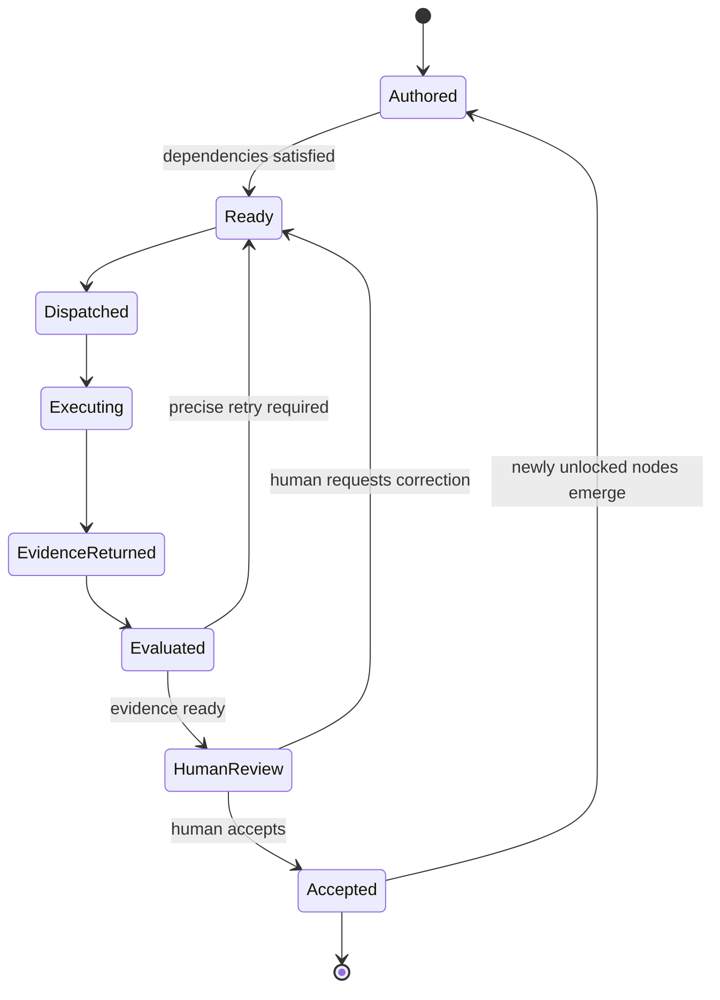
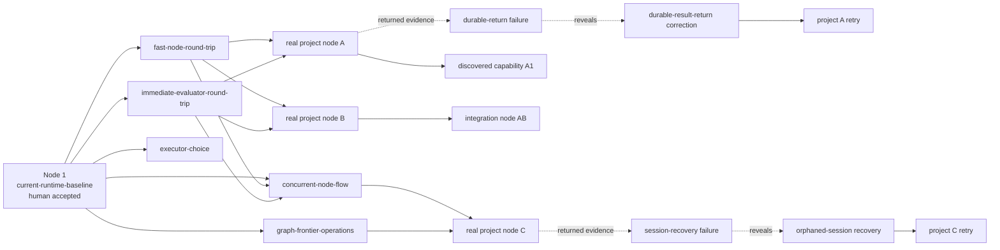

# GDDP - Project Brief

GDDP makes small, bounded project nodes economically viable and moves many of
them quickly without losing user intent, project integrity, auditability, or
human control.

## Purpose

GDDP is the intent-preservation and graph-integrity layer around agentic work.
It turns a project into an explicit graph, determines which nodes are ready,
observes implementation attempts, evaluates returned evidence, and presents the
human with precise review decisions. It does not make an executor authoritative
and it does not silently convert successful execution into project truth.

`gddp-config` owns the human-authored graph: nodes, dependencies, constraints,
and acceptance criteria. `gddp-runtime` reads that truth, moves jobs through the
operating loop, records durable evidence, and evaluates criteria and integrity.
Only human acceptance advances graph truth.

The unit of project intent is the **node**. A job, executor session, commit, test
run, or evaluator receipt describes an attempt to satisfy a node. None of those
objects replaces the node or completes it automatically.

## Canon Model

Four kinds of truth must remain separate:

- **Canon** defines the invariants and architectural boundaries that must remain
  true.
- **Graph** defines the work that currently exists, its dependencies, and its
  ready frontier.
- **Evidence** describes the outcome of execution attempts: commits, tests,
  artifacts, traces, and evaluator verdicts.
- **Human acceptance** decides whether that evidence is sufficient to change
  canonical graph state.

```mermaid
flowchart TB
    canon["Canon<br/>invariants and architectural boundaries"]
    graph["Graph<br/>current nodes, dependencies, and frontier"]
    job["Job / executor session<br/>one implementation attempt"]
    evidence["Evidence<br/>tests, artifacts, receipts, verdicts"]
    evaluator["Evaluator<br/>criteria + integrity judgments"]
    human["Human acceptance"]
    truth["Updated graph truth"]

    canon --> graph
    graph --> job
    job --> evidence
    evidence --> evaluator
    canon --> evaluator
    evaluator --> human
    graph --> human
    human --> truth
    truth --> graph
```

## Canonical Operating Loop

The central spine of GDDP is the node round trip:



Infrastructure exists to make this loop faster, more durable, more concurrent,
more observable, or more trustworthy. Infrastructure completion is never the
project's destination.

## Evaluator Boundary

The evaluator answers two bounded questions:

1. **Criteria verdict:** Did this attempt satisfy the node's acceptance
   criteria?
2. **Integrity verdict:** Does the implementation preserve project canon, user
   intent, and structural health?

Both verdicts produce evidence for human review. Neither verdict completes a
node. Tests are evidence, criteria are evidence, and evaluator verdicts are
evidence. Only a human-accepted node status is graph truth.

Integrity evaluation should test explicit invariants:

- The node remains the unit of project intent.
- Executor sessions remain attempts rather than project truth.
- Durable evidence returns before evaluation.
- Human authority over node completion remains intact.
- Infrastructure improves turnaround, concurrency, recovery, observability, or
  integrity.
- Real project nodes can move before all supporting infrastructure is
  theoretically complete.

## Current System Baseline

The graph begins again from current system truth:

- Direct Jules execution exists.
- Executor-neutral session abstractions exist.
- The durable result-return path remains incomplete.
- The evaluator and intent/integrity lane exist in working form.
- The production control plane, heartbeat, queue, and intake exist.
- The full round trip remains too fragile and expensive.
- The system has not yet demonstrated many small nodes moving concurrently
  through execution, evaluation, retry, and acceptance.

`current-runtime-baseline` establishes the temporal boundary. Existing work is
inventoried as present state with supporting evidence; it is not ignored, and it
is not retroactively described as graph-governed. Human acceptance of that
baseline establishes Node 1. All substantive work from that boundary forward is
represented by Node 1-N in the graph.

## Initial Graph Direction

The first graph grows around operating outcomes, then widens into real project
work as soon as the minimum round trip is usable:



Capability regions such as resilience and executor expansion are useful views,
not sequential roadmap phases. Their nodes coexist with real project work and
connect through actual dependency edges. The graph may widen, branch, reveal
missing prerequisites, and acquire corrective nodes. Its order comes from
dependency direction, not visual tidiness.

The development pattern is progressive:

1. Make the minimum direct return reliable enough to move one node.
2. Run several real nodes immediately.
3. Turn observed failures into evidence or narrowly scoped corrective nodes.
4. Run more independent nodes concurrently.
5. Expand the graph from discovered reality.

GitHub, Jules, Codex, and future executors are replaceable transports and
workers. GitHub may provide durable artifacts and review surfaces, but it is not
required to be the command bus. Direct Jules execution is a pressure-release
mechanism for lowering the cost and latency of nodes, not a destination.

## Success Condition

GDDP succeeds when smaller nodes are economically viable; several can move
without continuous supervision; evidence returns quickly and durably;
evaluation follows immediately; failures create precise corrective work; and
accepted work continuously expands the ready frontier.

The useful operating view answers:

- How many nodes are ready?
- How many are executing?
- How many returned evidence?
- How many require correction?
- How many await human acceptance?
- Which acceptances will unlock the next frontier?

Success is **more nodes moving faster**, with intent, provenance, graph
integrity, and human control preserved. It is not direct dispatch implemented,
an executor-neutral interface merged, or a large test count.

## Canonical Documents

The canon list, in order: **foundational node** (the first node in a project's
`project.yaml`; order is semantically meaningful), **README.md**,
**PROJECT-BRIEF.md** (this file), and **AGENTS.md**. Canon is small,
human-owned, and wins over other prose when they disagree.

Canon has audiences. `AGENTS.md` is executor canon and is deliberately excluded
from evaluator context. Evaluators judge against graph truth (node acceptance
criteria and constraints) plus README and project-brief context.

Vocabulary:

- **Verdict:** evaluator output.
- **Acceptance:** the human act that advances graph truth.
- **Decision:** the human's status call on a node.

Generated artifacts such as wikis, receipts, and handoffs capture canon; they
are never canon themselves.

## Deeper Documents

- README: [`README.md`](README.md)
- Tests and graph truth:
  [`docs/Tests-can-fail-nodes-can-pass.md`](docs/Tests-can-fail-nodes-can-pass.md)
- GDDP boundary:
  [`docs/GDDP-becomes-small-and-real.md`](docs/GDDP-becomes-small-and-real.md)
- Decision loop: [`docs/decision-loop-spec.md`](docs/decision-loop-spec.md)
- Config repository: [`../gddp-config/`](../gddp-config/)
