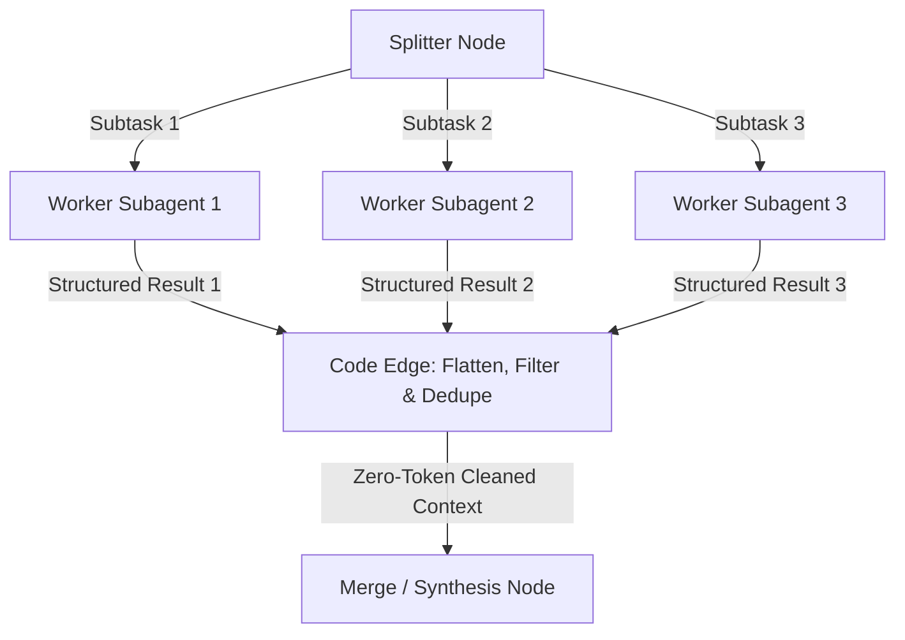
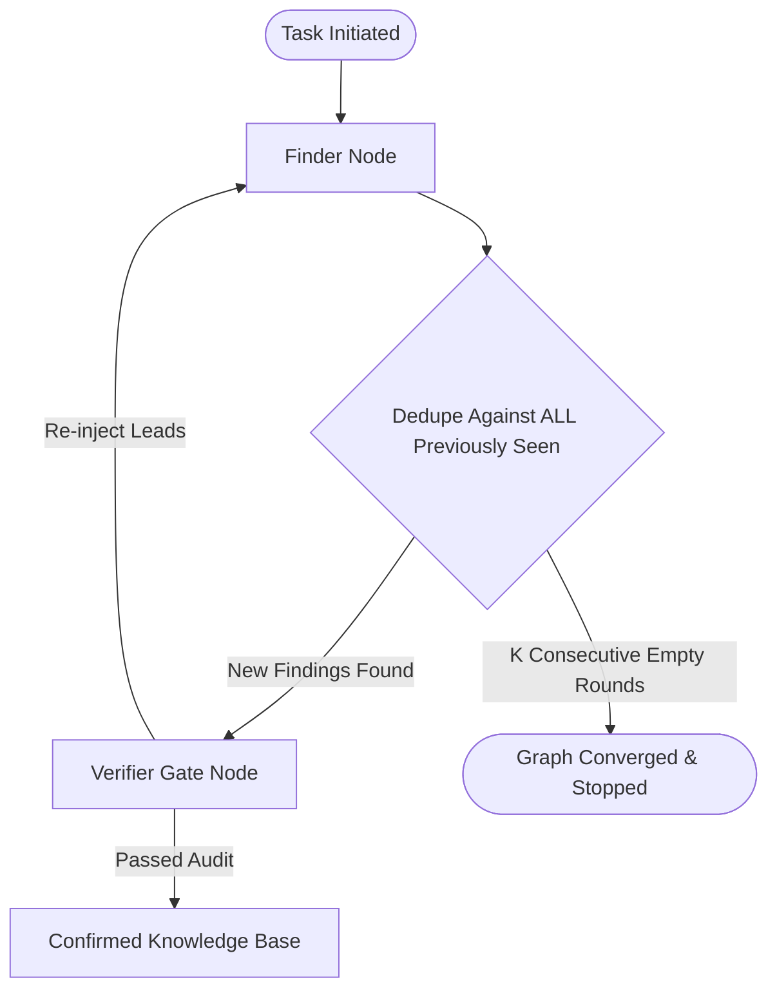
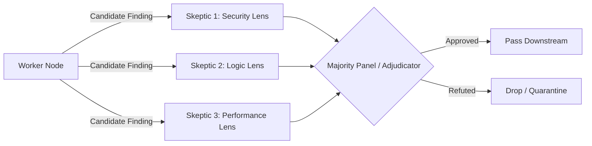
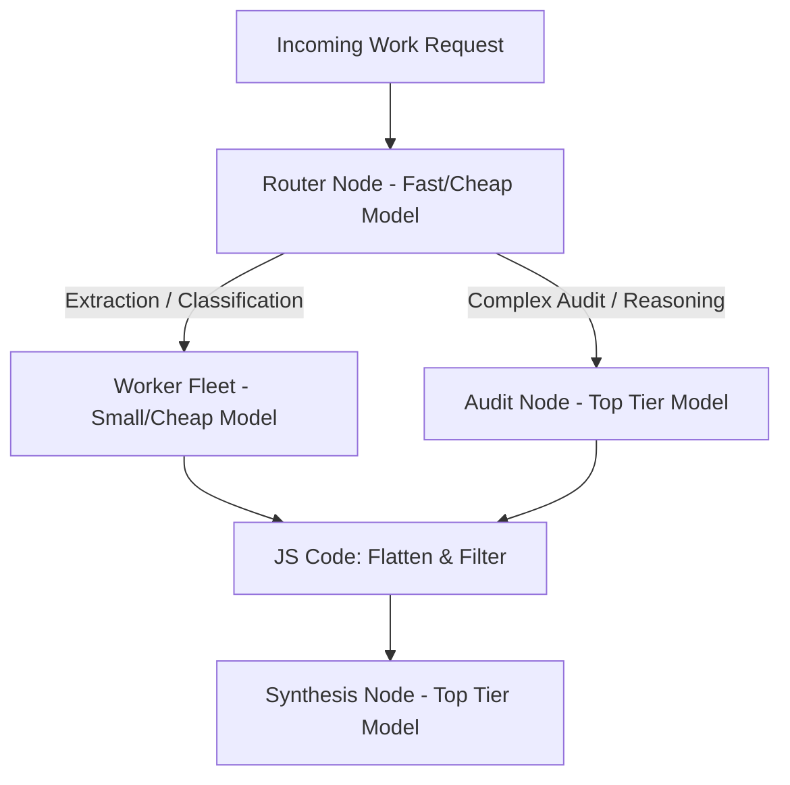
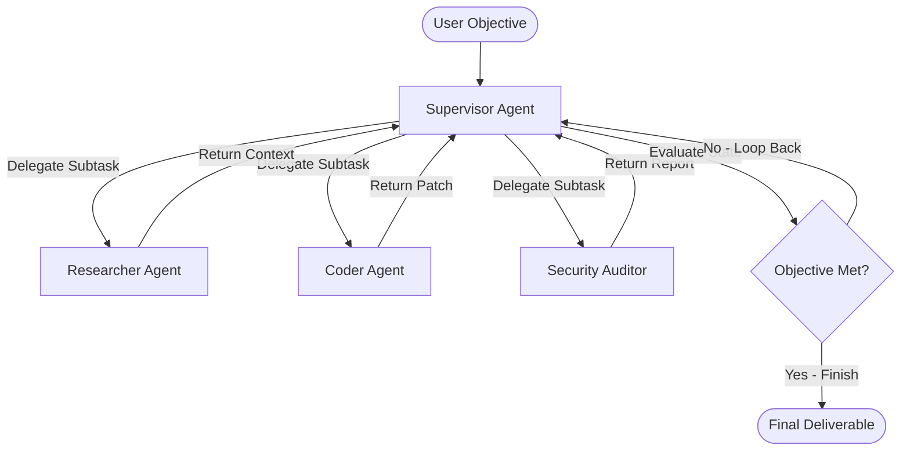

# Agent Graph Topology: A Production-Grade Technical Implementation Guide

## Summary

Production agent systems are **graphs**, not prompt chains. Reliability comes from topology plus explicit **state**: Iowa State data puts even strong graphs at an **81% pass rate**, with the remaining **19%** failing at intent-parsing (similar tools confused). Target query cost is **$0.001**; ISU hit **$0.00095** with model tiering. Zero-hallucination in that report came from prompt grounding plus a verifier node.

**Frameworks:** AutoGen is conversation-centric (agents message and delegate, human-in-the-loop via prompts). LangGraph is state-centric (nodes + edges, persistent state machine, checkpoints). Sections below keep ASCII for plain-text readers and **Mermaid.js** for graphical renderers.

| Pattern | Shape | Use when |
|---|---|---|
| 1 Linear chain | Start → validate → lookup → format → End | Low-ambiguity, $N$ feeds $N{+}1$ |
| 2 Diamond | Split → parallel workers → code flatten/dedupe → synthesize | Heterogeneous sources, latency |
| 3 Cycle / ReAct | Thought → act → observe → loop | Unknown-size discovery; halt after $K$ empty rounds |
| 4 Verifier on the edge | Worker → skeptic panel → pass or quarantine | Ground answers against tool output |
| 5 Runtime router | Fast model classifies → live MCP vs cached DB | Stale-data escape hatch |
| 6 Model tiering | Cheap model for extract; top-tier for audit/synthesis | Cost |
| 7 Supervisor | Supervisor delegates to isolated specialists, loops until done | Tool-selection confusion |
| Observability | Arize Phoenix traces by `session_id` / `user_id` | Every node transition and token spend |

**Contracts that keep the graph honest:** typed state (`TypedDict` / TS interface); `operator.add` reducers so parallel nodes merge instead of overwrite; workers return schema-validated JSON; flatten/filter on a **code edge** (zero model tokens); iterate with an `iteration_count`; supervisor reads shared state after every specialist return.

Continue below for schemas, LangGraph/TypeScript snippets, ASCII, and Mermaid for each pattern.

## 1. Introduction: The Architecture of Agentic Reason

The evolution of agentic AI marks a strategic shift from linear, single-prompt pipelines toward complex multi-agent graph topologies. While initial implementations relied on simple prompt chaining, production-grade systems require the ability to reason, adapt, and iterate through sophisticated workflows. This architectural transition is primarily defined by the choice of framework: Microsoft’s AutoGen and LangChain’s LangGraph. Synthesizing the core differences reveals that AutoGen utilizes a "conversation-centric" model, prioritizing LLM-to-LLM and human-in-the-loop interactions where agents collaborate like a coordinated team. In contrast, LangGraph employs a "state-centric" model, treating the agentic process as a structured state machine. In LangGraph, agents and tools are nodes within a graph, allowing for explicit control over loops, persistence, and error handling.

Selecting the appropriate topology is the primary determinant of system reliability. Empirical data from Iowa State University (ISU) research demonstrates that even robust topologies achieve an 81% pass rate, with the remaining 19% of failures occurring at the intent-parsing layer (e.g., semantic confusion between similar tools). This underscores that the architecture must not only facilitate execution but also manage the "State" transitions that define the system's reasoning boundaries.

### Framework Comparison: AutoGen vs. LangGraph

| Dimension | AutoGen | LangGraph |
|---|---|---|
| Focus | Multi-agent collaboration and messaging | Dynamic, state-centric workflows |
| Execution Model | Agents communicate and delegate automatically | Graph-based execution (Nodes and Edges) |
| State Management | Shared context between agents | Persistent, explicit state machine tracking |
| Human Review | Integrated via agent prompts/delegation | Built-in checkpoints and "human-in-the-loop" pauses |

Standard report files store text and code natively, so standard text renders ASCII art unless formatted within explicit **Mermaid.js** syntax.

Here are the complete visual **Mermaid diagrams** for all core agent topologies, ready to be rendered graphically by any Mermaid-compatible viewer. ASCII sketches remain under each pattern as the text-native form of the same shapes.

## 2. Pattern 1: The Linear Chain (Sequential Task Processing)

The Linear Chain is the foundational building block for low-ambiguity workflows. It is best suited for predictable, deterministic tasks where the output of node $N$ is the required input for node $N+1$, such as a simple researcher lookup where the identity must be validated before data retrieval.

### Visual Topology

```
[Start] --> [Auth/Validation] --> [Data Lookup] --> [Format Output] --> [End]
```

### Data Contract & State Schema

In a production graph, we must enforce a strict schema to prevent context drift.

**Python (LangGraph State)**

```python
from typing import TypedDict, List, Annotated
from operator import add


class AgentState(TypedDict):
    # 'add' reducer allows appending messages rather than overwriting
    messages: Annotated[List[str], add]
    author_id: str
    formatted_output: str
```

**TypeScript (Interface)**

```typescript
interface AgentState {
  messages: string[];
  authorId: string;
  formattedOutput: string;
}
```

### Technical Implementation

**LangGraph (Python)**

```python
from langgraph.graph import StateGraph, END


workflow = StateGraph(AgentState)
workflow.add_node("validate", validation_node)
workflow.add_node("lookup", lookup_professor_node)
workflow.add_node("format", formatting_node)


workflow.add_edge("validate", "lookup")
workflow.add_edge("lookup", "format")
workflow.add_edge("format", END)


workflow.set_entry_point("validate")
app = workflow.compile()
```

**Strategic Trade-off:** The Linear Chain is simple but brittle. It is insufficient for "fuzzy" queries where the lookup may fail, requiring a fallback or semantic search.

## 3. Pattern 2: Diamond Split-Reduce-Synthesize (Parallel Retrieval)

To handle heterogeneous data sources (DocumentDB, Graph, Vector Index) while minimizing latency, the Diamond topology executes multiple specialized tool calls simultaneously. This architecture creates a "barrier" where results must be collected before the synthesis node begins.

The workhorse shape for research, market scans, and code reviews. One node splits the objective, parallel subagents process isolated contexts concurrently, deterministic code flattens/filters the output, and a final synthesis node generates the answer.

### Visual Topology

```
          /--> [DocumentDB Lookup] --\
[Router] ----> [Semantic Search] ------> [Synthesizer] --> [End]
          \--> [Graph Traversal] ----/
```



- **Data Contract:** Subagents return schema-validated JSON.
- **Orchestration:** The edge between workers and the merge node lives in plain code (saving model tokens).

### State Schema & Reducers

To prevent parallel nodes from overwriting the retrieved_data field, LangGraph requires an Annotated type with a reducer function (like operator.add) to merge results.

```python
from operator import add
from typing import Annotated, List, TypedDict


class ParallelState(TypedDict):
    query: str
    # Reducer aggregates results from parallel branches into a single list
    retrieved_data: Annotated[List[dict], add]
    final_summary: str
```

### Technical Implementation

**LangGraph (Python)**

```python
# Convergence (Reduction) happens automatically in 'retrieved_data'
workflow.add_edge("router", "semantic_search")
workflow.add_edge("router", "graph_search")


workflow.add_edge("semantic_search", "synthesizer")
workflow.add_edge("graph_search", "synthesizer")
```

**Claude Code (TypeScript)**

```typescript
async function parallelRetrieval(query: string) {
  const controller = new AbortController();
  const timeoutId = setTimeout(() => controller.abort(), 5000); // Production-grade timeout


  try {
    const results = await Promise.all([
      callSemanticSearch(query, controller.signal),
      callGraphTool(query, controller.signal)
    ]);
    return synthesizeAndDeduplicate(results);
  } finally {
    clearTimeout(timeoutId);
  }
}
```

**Architectural Impact:** This solves the "Semantic Gap" identified in the ISU report (Ch 4.3.3), where keyword search alone fails to match related topics (e.g., "autonomous vehicles" vs. "self-driving cars") by forcing the agent to consult a vector index and structured store simultaneously.

## 4. Pattern 3: Cycle with ReAct Loop (Loop-Until-Convergence)

The ReAct (Reasoning + Acting) loop is required for multi-step queries where the next action depends on previous observations. Following Figure 3.3 of the ISU component, the system iterates through a formal "Thought" process before acting.

Designed for **unknown-size discovery** (e.g., bug sweeps, security audits) where finding one issue uncovers new leads.

### Visual Topology

```
[Start] --> [Thought] --> [Action (Tool)] --> [Observation]
               ^                                 |
               \---------- [Conditional Edge] ---/
```



- **Convergence Rule:** Halts after $K$ consecutive empty rounds.
- **Deduplication:** Deduplicates against *everything ever seen* (including dead ends) so the agent never pays to rediscover rejected leads.

### Data Contract: Safety & Transparency

```python
class ReActState(TypedDict):
    messages: Annotated[List[str], add]
    iteration_count: int # Prevent infinite loops/cost spiraling
    thought_log: List[str] # Reasoning transparency
```

### Technical Implementation

**LangGraph (Python)**

```python
def should_continue(state: ReActState):
    # Inspection of the AIMessage object for tool_calls
    last_message = state["messages"][-1]
    if last_message.tool_calls:
        return "tools"
    return END


workflow.add_conditional_edges("agent", should_continue)
```

**Strategic Importance:** With a query cost target of $0.001, managing convergence conditions is critical to prevent the LLM from entering a high-latency, high-token cycle.

## 5. Pattern 4: Verifier on the Edge (Hallucination Control)

To address the "Evaluation Gap," a Verifier node acts as a grounding judge. It compares the generator's final_answer against the tool_outputs stored in the state.

Improves system reliability by gating edges with dedicated verifier nodes before findings can reach downstream stages.

### Visual Topology

```
[Generator] --> [Verifier] --(Ungrounded/Fail)--> [Generator (Retry)]
                    |
                 (Pass) --> [End]
```



- **Verification Lenses:** Employs adversarial skeptics or diverse perspectives (correctness, security, reproducibility) to filter out false positives.

### Implementation (Python)

The verifier enforces a "must-not-include" list to catch citations or email addresses not present in the DocumentDB/MCP results.

```python
def verifier_node(state: AgentState):
    last_msg = state["messages"][-1].content
    grounding_data = state["retrieved_data"]

    if detects_hallucination(last_msg, grounding_data):
        return "generator_retry"
    return END
```

**Synthesis:** The ISU report achieved a zero-hallucination result by combining prompt-level grounding ("cite only tool facts") with this explicit node-level verification.

## 6. Pattern 5: Conditional Runtime Routing (Intent-Based Dispatch)

This pattern addresses the "Stale Data" failure mode by creating an escape hatch for real-time information using Model Context Protocol (MCP) triggers.

Routes execution paths dynamically at runtime based on model classification while maintaining code-level determinism.

### Visual Topology

```
             /-- ("recent" trigger) --> [MCP Scholar Server (Live)]
[Router Node]
             \-- (Default) -----------> [DocumentDB (Cached)]
```



- **Model Tiering:** Routes repetitive tasks to smaller, inexpensive models while reserving top-tier models for synthesis and adjudication.

### Implementation (Python)

```python
def router(state: AgentState):
    query = state["messages"][-1].content.lower()
    # Explicit linguistic triggers for real-time dispatch
    if any(k in query for k in ["recent", "latest", "newest"]):
        return "live_mcp_source"
    return "cached_document_db"
```

## 7. Pattern 6: Model Tiering (Cost-Efficiency Optimization)

Platform architects must optimize "Return-on-AI" by offloading lower-complexity reasoning to smaller models. The ISU report achieved a $0.00095 average query cost by using GPT-4o-mini for routing and reserve GPT-4o for final synthesis.

The router/tiering Mermaid diagram in Pattern 5 is the graphical form of this split: cheap model for extraction and classification, top-tier model for audit and synthesis.

### State Schema: Token Economics

```python
class TieredState(TypedDict):
    messages: Annotated[List[str], add]
    token_usage: dict # { "prompt": int, "completion": int }
    calculated_cost: float
```

### Implementation (Python)

```python
# Pass different model strings to nodes within the same graph
workflow.add_node("router", ChatOpenAI(model="gpt-4o-mini"))
workflow.add_node("complex_reasoning", ChatOpenAI(model="gpt-4o"))
```

## 8. Pattern 7: Multi-Agent Supervisor (Hierarchical Orchestration)

When an agent manages high-complexity queries, "Tool Selection Confusion" often occurs. ISU Chapter 6.3 highlights a specific failure where agents confuse find_connection (Graph tool) with get_shared_publications (DocumentDB tool). Hierarchical orchestration isolates these tools.

A centralized supervisor agent coordinates specialized subagents across iterative cycles.

### State Schema: Global Context

```python
class GlobalContext(TypedDict):
    # Shared among sub-agents
    session_id: str
    aggregated_findings: List[dict]
    active_agent: str
```

### Visual Topology

```
                   /--> [Graph Agent (Isolates find_connection)]
[Supervisor Node] <---> [Search Agent (Isolates lookup/search)]
                   \--> [Live Agent (Isolates MCP tools)]
```



- **State Synchronization:** Every specialist returns control to the supervisor, which reads shared state to determine the next action.

**Analysis:** By isolating semantically similar tools into different sub-agent domains, the LLM is forced to select an agent intent first, significantly reducing the probability of the tool-confusion failure mode.

## 9. Observability: Tracing the Reasoning Chain

Production-grade agents require distributed tracing to debug non-deterministic graphs. We utilize Arize Phoenix (as per ISU Chapter 5.4) to group traces by session_id and user_id.

### Implementation (Python)

```python
from phoenix.trace.langchain import LangChainInstrumentor


# Initialize the tracer at the application level
LangChainInstrumentor().instrument()


# Wrap execution in a tracing span with OpenInference attributes
with using_attributes(
    user_id="arch_lead_01",
    session_id="session_778",
    model_version="gpt-4o-2024-05-13"
):
    # Every node transition and tool call is now a child span
    app.invoke({"messages": [HumanMessage(content="Find connection path between...")]})
```

By linking topology selection to production observability, we move from "hoping it works" to a state where every node transition and token expenditure is transparent, ensuring the agent remains grounded, cost-effective, and reliable.
