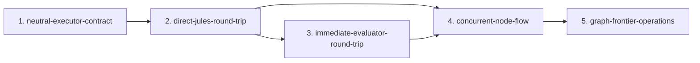
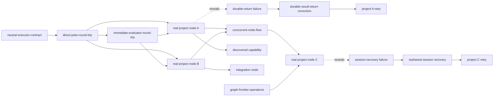

# Draft Canonical Graph Neutral Executor Graph Plan

## 1. `neutral-executor-contract`

**Purpose**

Define one executor-neutral way for GDDP to send a node out for implementation and receive the result back.

### Acceptance criteria

- [ ] The same complete node packet can be given to Jules or another executor without changing the node’s meaning.
- [ ] GDDP can identify and track each execution attempt independently of the executor being used.
- [ ] Every executor returns work through one shared, understandable result shape.
- [ ] Executor output remains evidence only and does not change graph truth automatically.

---

## 2. `direct-jules-round-trip`

**Purpose**

Use the Jules API to remove the long GitHub issue, action, pull request, and webhook round trip.

**Depends on**

- `neutral-executor-contract`

### Acceptance criteria

- [ ] I can dispatch one real ready node directly to Jules without creating a GitHub issue or relying on the Jules GitHub Action path.
- [ ] Jules’s returned work appears inside GDDP as durable, reviewable evidence without manual file transfer or database repair.
- [ ] A failed or interrupted attempt remains visible and can be retried without losing the original attempt.
- [ ] A successful Jules attempt stops at reviewable evidence and does not complete the node automatically.

---

## 3. `immediate-evaluator-round-trip`

**Purpose**

Evaluate returned work immediately so that executor completion quickly becomes a meaningful human review decision.

**Depends on**

- `direct-jules-round-trip`

### Acceptance criteria

- [ ] Returned work enters evaluation without requiring me to manually move evidence or start the evaluation process.
- [ ] I can see a clear judgment for each acceptance criterion and the evidence used for that judgment.
- [ ] I can separately see whether the implementation preserved project intent and integrity.
- [ ] The completed evaluation gives me enough information to accept, retry, block, or defer the node, but cannot make that decision for me.

---

## 4. `concurrent-node-flow`

**Purpose**

Reduce total project time by allowing independent nodes and their evaluations to move at the same time.

**Depends on**

- `immediate-evaluator-round-trip`

### Acceptance criteria

- [ ] I can dispatch at least two independent real nodes and see both being worked on at the same time.
- [ ] When independent nodes return work, their evaluators can run at the same time without mixing their evidence or results.
- [ ] One node succeeding, failing, requiring correction, or awaiting acceptance does not incorrectly pause or alter another independent node.
- [ ] After I accept a node, any newly unblocked node can begin moving while unrelated execution and evaluation work continues.
---

## 5. `graph-frontier-operations`

**Purpose**

Show what work is ready now, what is already moving, and what human acceptance unlocks next.

**Depends on**

- `immediate-evaluator-round-trip`

### Acceptance criteria

- [ ] I can see which nodes are ready now and which incomplete dependencies prevent other nodes from becoming ready.
- [ ] A node already executing, being evaluated, or awaiting review is not offered for duplicate dispatch.
- [ ] I can see which downstream nodes would become ready if I accepted a node currently awaiting review.
- [ ] When I accept a node, graph truth updates and the correct newly available nodes become ready.---

# Fixed capability sequence

# Remaining nodes from the original graph

These are not five more predefined infrastructure nodes. They are nodes that enter the graph through actual project work and observed evidence.

## Real project nodes

Examples:

- `real-project-node-a`
- `real-project-node-b`
- `real-project-node-c`

These are actual useful tasks in GDDP or another project, such as implementing a feature, fixing a bug, or adding a project capability.

Real project nodes should begin moving as soon as the direct executor and evaluator round trips are usable.

## Discovered capability nodes

Example from the original diagram:

- `discovered-capability-a1`

A real project node may reveal that GDDP or the target project lacks a capability that was not known beforehand. That newly discovered need becomes its own small node.

## Integration nodes

Example:

- `integration-node-ab`

Two completed pieces may work independently but still require a small node to connect them. Integration work should be created when the dependency becomes real rather than being predicted far in advance.

## Corrective nodes

Examples from the original diagram:

- `durable-result-return-correction`
- `orphaned-session-recovery`

These appear when a real execution attempt exposes a specific failure. The failure becomes evidence for one narrowly scoped corrective node.

## Retry nodes or retry attempts

Examples:

- `project-a-retry`
- `project-c-retry`

After a corrective node is accepted, the original project node can be attempted again. Whether this is represented as a new graph node or another attempt against the original node should remain an explicit graph-design decision.

# Overall graph shape

The five named capability nodes are the current draft spine. Real project, discovered, integration, corrective, and retry nodes are added as the system is actually used.
