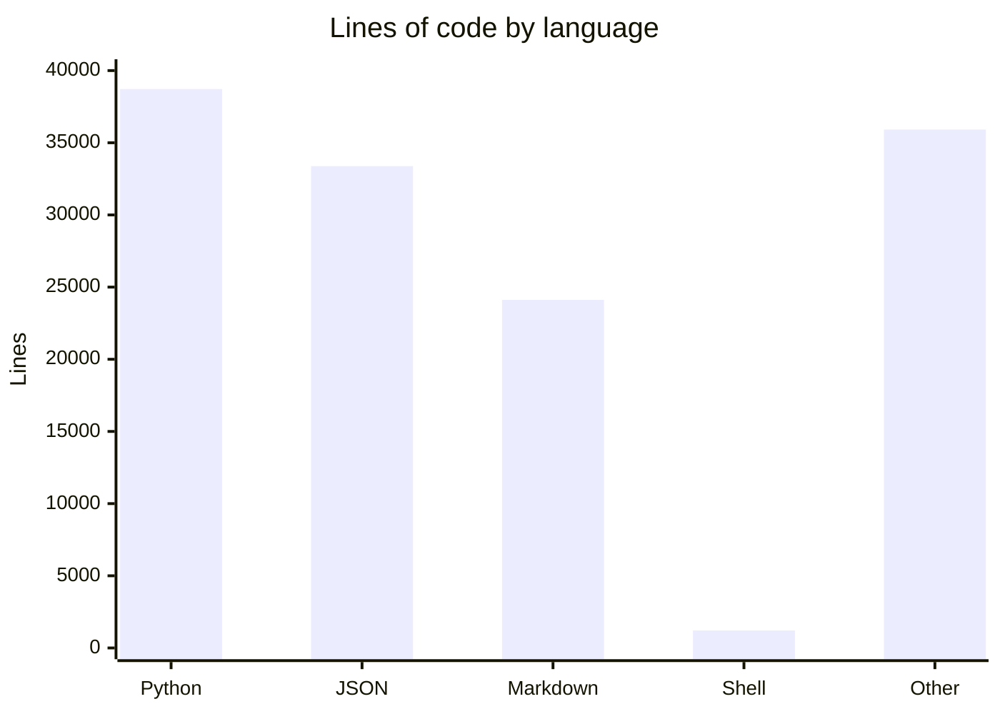

# gddp-runtime by the numbers

Data collected on 2026-08-08. All figures measured against `origin/main`, excluding `db/`, `jobs/`, `events/`, `graphify-out/`, `.worktrees/`, and `__pycache__/`.

## Repository size

| Language | Files | Lines of code |
|----------|------:|--------------:|
| Python   |   140 |        38,723 |
| Markdown |   175 |        24,114 |
| JSON     |    44 |        33,384 |
| Shell    |    17 |         1,213 |
| Other    |    65 |        35,915 |
| **Total**|   441 |       133,349 |

### File breakdown

| Category | Count |
|----------|------:|
| Source Python (under `scripts/`, excl. test) | 79 |
| Test Python (`*test*.py`) | 61 |
| Config (`.yml`, `.yaml`, `.toml`, `.json`, `.service`, `.plist`, `.env`, `.ini`) | 52 |
| Markdown docs | 175 |

### Lines by language

## Activity

| Metric | Value |
|--------|------:|
| Total commits | 464 |
| Commits in last 90 days | 428 |
| First commit | 2026-03-13 |
| Days of project history | 148 |

### Churn hotspots (last 90 days, files touched)

| Directory | Files touched |
|-----------|-------------:|
| `scripts/runtime/` | 460 |
| `docs/` | 244 |
| `.handoffs/` | 165 |
| `deploy/` | 109 |
| `scripts/adapters/` | 104 |
| `droid-wiki/` | 78 |

The runtime and adapters directories dominate -- the bulk of active development is the execution loop and its integration with external agent harnesses.

## Bot-attributed commits

| Signal | Count |
|--------|------:|
| Commits with a `Co-authored-by:` matching `factory-droid`, `dependabot`, `github-actions`, or `jules` | 83 |
| Total commits | 464 |
| **Bot co-author percentage** | **~18%** |

This is a lower bound: some bot contributions may not carry a `Co-authored-by` trailer, and some sessions with bot participation may list only the human author.

## Complexity

| Metric | Value |
|--------|------:|
| Python files under `scripts/` | 131 |
| Total LOC under `scripts/` | 37,415 |
| **Average file size** | **285 lines** |

### Deepest packages under `scripts/`

| Package | Files | LOC |
|---------|------:|----:|
| `scripts/runtime/heartbeat/` | 25 | 10,612 |
| `scripts/adapters/` | 18 | 7,579 |
| `scripts/runtime/verification/` | 21 | 5,780 |
| `scripts/runtime/verification/semantic/` | 13 | 2,599 |
| `scripts/runtime/verification/deterministic/` | 6 | 2,062 |
| `scripts/runtime/decision_loop/` | 8 | 1,136 |

### Largest individual files

| File | LOC |
|------|----:|
| `scripts/runtime/heartbeat/test_executor_sessions.py` | 2,652 |
| `scripts/runtime/heartbeat/reconciler.py` | 1,478 |
| `scripts/runtime/verification/deterministic/probes.py` | 1,021 |
| `scripts/runtime/verification/test_orchestrator.py` | 914 |
| `scripts/adapters/test_mission_adapter.py` | 909 |
| `scripts/adapters/mission_evidence.py` | 889 |
| `scripts/runtime/heartbeat/test_mission_pipeline_e2e.py` | 837 |
| `scripts/runtime/heartbeat/runner.py` | 821 |
