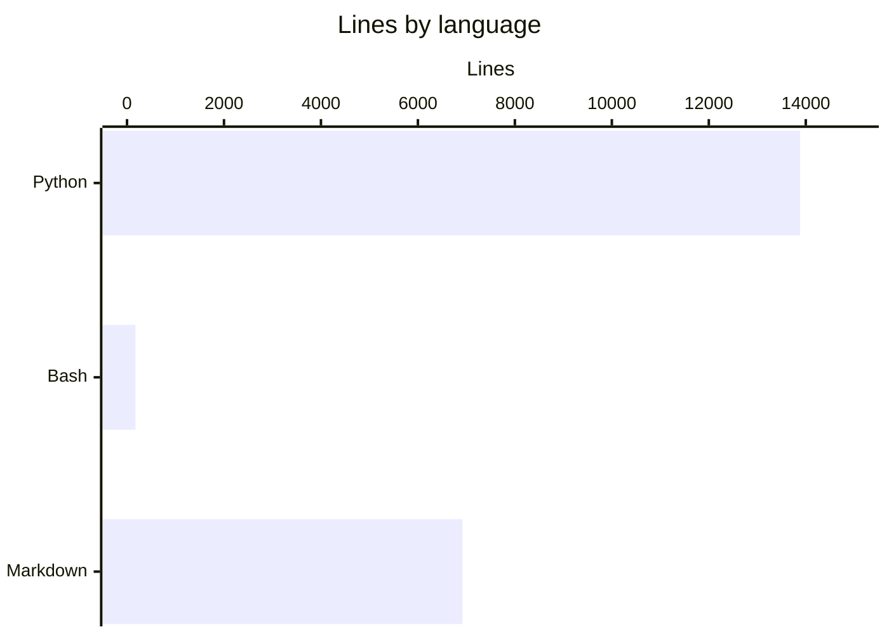

# By the numbers

Data collected on 2026-07-09.

## Size

The codebase is mostly Python, with Bash for deployment glue and Markdown for documentation. Test files make up a meaningful slice of the Python surface: 28 of 82 Python files are tests.

| Language | Lines | Files |
|---|---:|---:|
| Python | 13,884 | 82 |
| Bash | 174 | 3 |
| Markdown | 6,919 | 63 |

## Activity

164 total commits across the history of the repo.

| Month | Commits |
|---|---:|
| Mar 2026 | 24 |
| Apr 2026 | 5 |
| May 2026 | 28 |
| Jun 2026 | 28 |
| Jul 2026 | 79 |

July 2026 is the busiest month by a wide margin, holding nearly half of all commits. The April dip lines up with the handoff between the original heartbeat loop and the modular rewrite.

## Bot-attributed commits

0 commits carry a bot co-author trailer. Every commit in the history is human-authored as far as git metadata goes. Treat this as a lower bound on AI-assisted work, not evidence of it being absent. The project is built and operated with agent assistance, but that assistance does not surface as bot co-authorship in the commit log.

## Complexity

Churn hotspots: most changed files in the last 90 days. These are the files that keep getting touched, which is a rough proxy for where the active design work is happening.

| File | Changes (last 90 days) |
|---|---:|
| AGENTS.md | 11 |
| docs/gdd-explained.html | 9 |
| test_semantic_agent_tools.py | 7 |
| .gitignore | 7 |
| test_orchestrator.py | 6 |
| schemas.py | 6 |
| orchestrator.py | 6 |
| cli.py | 6 |
| bridge.py | 6 |
| runner.py | 6 |
| engine.py | 6 |
| init_db.py | 6 |

`AGENTS.md` sits at the top, which fits a project where the operator-facing contract keeps getting refined as the runtime evolves. The verification cluster (`orchestrator.py`, `schemas.py`, `bridge.py`, and their tests) shows up as a group, reflecting the verification system being built and reworked through the spring and summer. `.gitignore` churn tracks generated artifacts being added and excluded as the pipeline grew.
