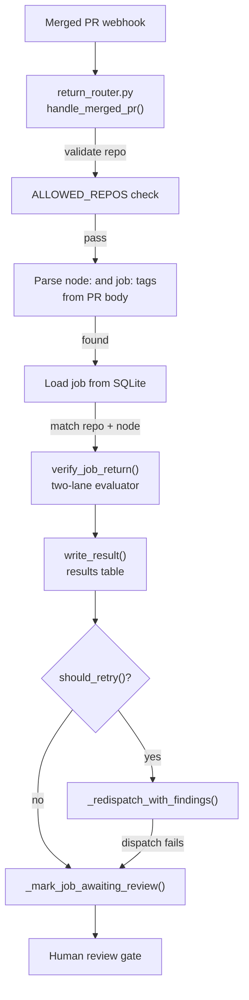

# Receipt-based return

The receipt-based return flow is the core pattern that enforces the runtime's central invariant: no merged PR silently advances graph truth. When an executor's PR merges, the runtime does not update the project graph, mark the node complete, or move on. Instead it creates a structured receipt, runs verification, and parks the job at `awaiting_review` for a human to decide. The runtime produces evidence. Only a human moves a node forward.

## The full flow

### 1. PR merges

The flow starts when a GitHub webhook for a merged PR arrives at the intake server and lands in the `events` table. The heartbeat runner picks it up and hands it to `return_router.py`'s `handle_merged_pr()`.

### 2. Return router parses tags

The PR body must carry two metadata tags that tie the PR back to a job and a graph node:

- `node: <node_id>` (parsed by `parse_node_id()`)
- `job: <job_id>` (parsed by `parse_job_id()`)

The router also validates the repository against `ALLOWED_REPOS`, loads the job from SQLite, and checks that the job's `repo` and `node_id` match what the PR claims. Any mismatch (missing tags, repo not allowed, job not found, repo/node mismatch) results in a `rejected` status with a specific reason. These are hard stops, not warnings.

### 3. Verify

The router calls `verify_job_return()` from the verification bridge, which runs the two-lane evaluator (deterministic criteria probes + semantic LLM agent, combined worst-of with the integrity lane). The verdict is evidence, not a graph decision. An evaluator failure is recorded in the receipt but is never fatal: the job still routes to `awaiting_review` so a human can inspect whatever the evaluator managed to produce.

### 4. Write receipt to results table

`write_result()` in `results_store.py` inserts a row into the `results` table with:

- The verification output stored in `acceptance_check`
- The GitHub action metadata (repo, PR number, merged URL, event ID) in `github_action`
- `status` set to `needs_review` and `review_required: true`

The `results` table has a foreign key to `jobs(job_id)` and a `schema_version` column (`1.0`) for future migrations. `write_result()` is idempotent: if the `result_id` already exists, it updates the row instead of inserting a duplicate.

### 5. Route to awaiting_review

`_mark_job_awaiting_review()` sets the job's `status` and `queue_state` to `awaiting_review` and updates the `queue_records` table to match. At this point the runtime's job is done. The receipt and verdict sit in SQLite, the job is parked, and a human reviewer is the only thing that can move the node forward.

Before routing to `awaiting_review`, the router checks the [retry loop](retry-loop.md): if the verdict is non-pass with evidence-referenced findings and the project's retry budget has room, the job is re-dispatched to the executor instead. Only when retry is exhausted or not applicable does the job land at the review gate.

## The five manual review actions

Once a job is at `awaiting_review`, a human reviewer decides what happens next. The five actions:

| Action | What it means |
|---|---|
| **Accept** | The work satisfies the node's criteria. The reviewer updates graph truth in `gddp-config` (the runtime never does this). The node is marked complete. |
| **Retry** | The findings are fixable but the retry budget is exhausted, or the reviewer wants a fresh attempt with specific guidance. The job is re-dispatched to the executor. |
| **Block** | The work is wrong in a way that should not be retried automatically. The node stays blocked until the reviewer resolves the blocker or changes the graph. |
| **Defer** | The work is acceptable for now but the reviewer is not ready to advance the node. The job stays parked without a verdict-driven action. |
| **Reopen / supersede** | The work is superseded by a new approach. The reviewer may open a new node, restructure the graph, or re-dispatch with a revised scope. |

Every one of these is a human action. The runtime provides the receipt, the verdict, and the findings. The human provides the decision.

## Why this matters

The runtime is forbidden from mutating config truth. This is not a policy preference, it is the architectural boundary that makes the whole system safe to run semi-autonomously. If a merged PR could advance a node automatically, the runtime would be both the executor and the judge, and a bad merge would silently corrupt the project graph. The receipt pattern prevents that by inserting a structured evidence layer between "PR merged" and "node complete." The human reviewer is the last gate, and the evaluator is the second-to-last gate, never the last.

The `results_store.py` module also maintains a separate `decision_results` table for the decision loop's actions (dispatch, escalate, no_op). That table has no foreign key to `jobs` because some decisions (like a no_op or a stale-state clean) have no associated job. Both tables share the same rule: they record what the runtime did, they do not touch graph truth.

## Key source files

| File | Purpose |
|---|---|
| `scripts/runtime/return_router.py` | The return flow entry point: tag parsing, repo validation, job matching, verification call, receipt write, retry check, routing to `awaiting_review`. |
| `scripts/runtime/results_store.py` | Receipt persistence: `write_result()` inserts/updates the `results` table; `init_db()` ensures schema. Also manages the `decision_results` table. |
| `scripts/runtime/verification/bridge.py` | `verify_job_return()` runs the two-lane evaluator in a subprocess and returns the verdict receipt. |

## Related pages

- [Retry loop](retry-loop.md)
- [Features](index.md)
- [Architecture](../overview/architecture.md)
- [Return router system](../systems/return-router.md)
- [Verification system](../systems/verification.md)
