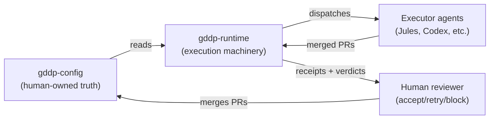
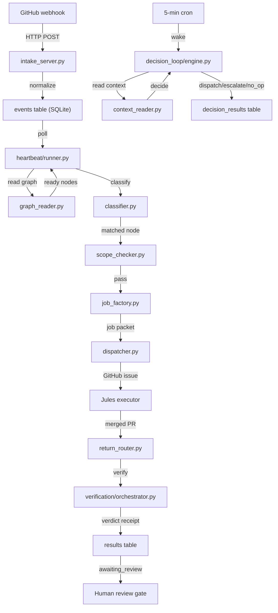

# Architecture

GDDP Runtime is a control plane that sits between a human-authored project graph and executor agents. It reads graph truth, dispatches bounded work, evaluates returns, and stops at a human review gate.

## Two-repo split

| Repository | Role |
|---|---|
| `gddp-config` | Human-owned project truth: schemas, templates, project graphs as YAML. Agents read it, never write it. |
| `gddp-runtime` | Execution machinery: heartbeat runner, executor adapters, webhook intake, SQLite state, receipt handling, verification, decision loop. |

## System flow

## Major subsystems

### Webhook intake

`scripts/intake_server.py` is a Flask server that receives GitHub webhooks, validates HMAC signatures, normalizes events into a controlled taxonomy, and inserts them into the `events` table. Raw payloads are saved to disk for auditing. Deployed as a systemd service.

### Heartbeat dispatch loop

`scripts/runtime/heartbeat/runner.py` is the canonical entry point. It reads the project graph from `gddp-config`, finds ready nodes, fetches pending events from SQLite, atomically claims events, classifies them, scope-checks, builds job payloads, dispatches in parallel worker threads, and records outcomes. Stale claims (30+ minutes) are re-eligible.

### Return router

`scripts/runtime/return_router.py` converts merged PRs into structured review receipts. It parses `node:` and `job:` metadata from PR bodies, validates repos against an allowlist, runs the verification bridge, writes the receipt to the `results` table, and routes the job to `awaiting_review`. If the verdict is non-pass with evidence-referenced findings and the retry budget has room, it re-dispatches with findings injected into the issue body.

### Two-lane verification

`scripts/runtime/verification/` is the evaluator. It has two lanes:

- **Lane 1 (criteria):** Deterministic probes check acceptance criteria using regex, file existence, command execution, and tier configuration. Indeterminate criteria get escalated to a semantic LLM agent that uses read-only tools to investigate the repo. A 12-row decision matrix combines deterministic + semantic results into a criteria verdict.
- **Lane 2 (integrity):** A fresh-eyes drift review that asks whether the work preserves the node's intended role in the project graph. The integrity combiner takes the worst-of the two lanes: integrity can only worsen the verdict, never upgrade it.

### Decision loop

`scripts/runtime/decision_loop/engine.py` is an event-driven reasoning layer. On each wake (webhook or cron), it cleans stale state, reads project context, and decides: verify a complete node, dispatch an eligible node, escalate a stuck job, or no-op. It persists every decision to the `decision_results` table.

### Executor adapters

`scripts/adapters/jules_action_adapter.py` dispatches work to Jules by creating GitHub issues with the `jules` label. The adapter pattern is executor-agnostic: new adapters for Codex, Vertex, or custom executors can plug in behind the same dispatch contract.

### State persistence

`scripts/init_db.py` initializes six SQLite tables: `events`, `jobs`, `queue_records`, `results`, `artifact_verifications`, `decision_results`. All mutations go through `state_recorder.py` and `results_store.py`. No ad hoc SQL scattered across the codebase.

## Key invariants

1. **Runtime never mutates graph truth.** Merged PRs create receipts. Humans decide whether graph truth changes.
2. **Receipt-based return flow.** No silent writeback to the project graph.
3. **Worst-of verdict combination.** The integrity lane can only worsen the criteria verdict, never upgrade it.
4. **Subprocess isolation for verification.** The evaluator runs as a subprocess so a crash, hang, or timeout cannot take down the return router.
5. **Read-only semantic tools.** The semantic agent's tools block network access, file mutations, git mutations, and destructive shell verbs.

## Language breakdown

The codebase is primarily Python (13,884 lines across 82 files, 28 of which are tests), with Bash for deployment scripts (174 lines) and Markdown for documentation (6,919 lines across 63 files).
