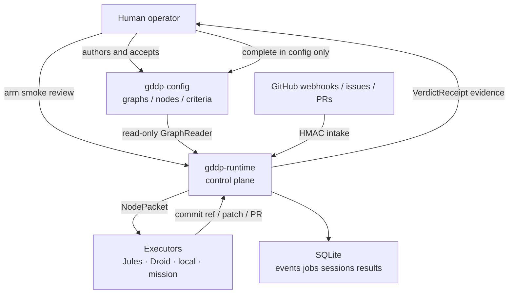
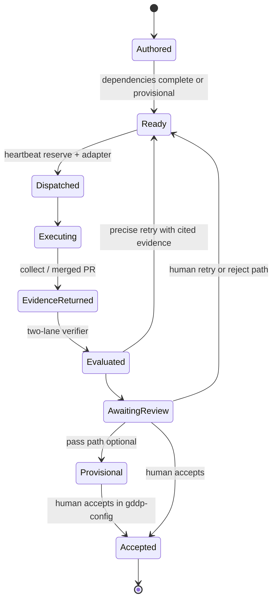
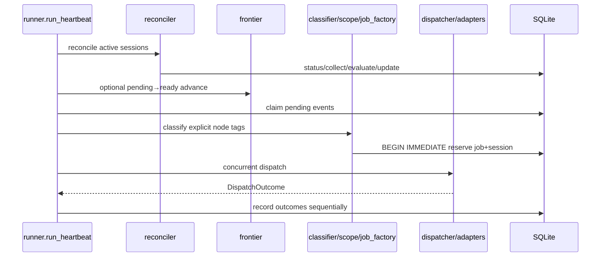
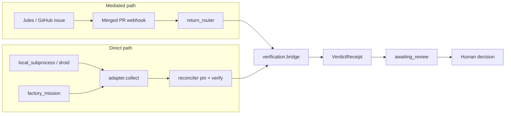
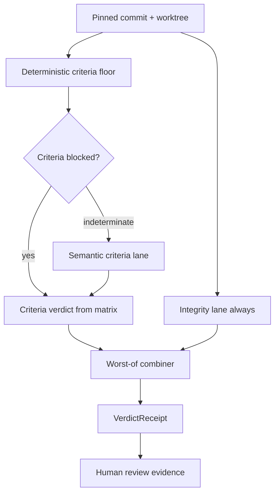

# Architecture

GDDP Runtime is an evidence-producing control plane around a human-owned DAG. Graph YAML lives in `gddp-config`. Runtime owns events, jobs, sessions, results, and evaluator receipts in SQLite. Executors are adapters. Humans remain the last gate.

## System context

## Canonical operating loop

## Major components

| Component | Path | Responsibility |
| --- | --- | --- |
| Intake | `scripts/intake_server.py` | Validate webhook HMAC, normalize events, persist raw + row |
| Heartbeat runner | `scripts/runtime/heartbeat/runner.py` | One tick: reconcile → frontier → claim → plan → dispatch → record |
| Graph reader | `scripts/runtime/heartbeat/graph_reader.py` | Cached YAML read of project/nodes from config repo |
| Classifier / scope | `classifier.py`, `scope_checker.py` | Explicit `node: <id>` routing; block duplicate/ineligible work |
| Dispatcher | `scripts/runtime/heartbeat/dispatcher.py` | Job → `NodePacket` → adapter selection |
| Reconciler | `scripts/runtime/heartbeat/reconciler.py` | Session poll, collect, pin commit, evaluate, retry/review |
| Adapters | `scripts/adapters/` | Jules issue, local subprocess/Droid, Factory mission |
| Verification | `scripts/runtime/verification/` | Deterministic criteria + semantic + integrity → `VerdictReceipt` |
| Return router | `scripts/runtime/return_router.py` | Mediated merged-PR path to receipt + review |
| Jobs status | `scripts/jobs_status.py` | Operator runtime reads/writes; audited; no graph mutation |
| Mini-heartbeat | `deploy/mini-heartbeat/` | Env, arm/disarm, launchd/systemd, smoke |

Language mix on `origin/main` is effectively all Python (~39k lines of `.py` including tests), plus shell deploy kits and markdown doctrine.

## Heartbeat tick (control flow)

Important properties:

- Reconciliation runs even when no new webhook arrives, so async executors progress.
- Reservation rows (`executor_sessions.state='dispatching'`) are written under `BEGIN IMMEDIATE` before external launch.
- Worker threads must not share the coordinator SQLite connection.
- `awaiting_review` counts as active and blocks duplicate dispatch for the same node.

## Two return pathways

Direct adapters return commit refs (or engagement-sliced patch results). The mediated path still exists as inherited infrastructure; it is not the required command bus for new work.

## Evaluator shape

Rules that shape architecture:

- Integrity can only preserve or worsen the criteria verdict.
- A pass may mark the graph node `provisional` (scheduler-visible); it never writes `complete`.
- Tests are evidence only when the node names them as acceptance criteria.
- Semantic and integrity harnesses are read-only against the subject tree.

## Persistence boundary

Runtime state lives under the runtime root (default repo root locally):

| Store | Path pattern | Contents |
| --- | --- | --- |
| SQLite | `db/queue.db` (+ WAL) | events, jobs, queue_records, results, decision_results, executor_sessions |
| Events | `events/` | Raw webhook payloads on disk |
| Jobs / spool | `jobs/`, configured spool dirs | Per-attempt packet, logs, exit.json |
| Mission sessions | `db/mission-sessions/` (overrideable) | Factory mission durable records |
| Gates | `.gddp/gates/<node>.token` | Provisional admission tokens |

`db/`, `jobs/`, and `events/` are heavy runtime dirs excluded from git.

## Deployment topology (summary)

| Host | Role |
| --- | --- |
| `sab-mini` | Production control plane: intake + heartbeat via launchd |
| `pi-big` | Former production; disarmed, offline backup of secrets |
| `sab-dev` / mission VMs | Agent session hosts; dry-run or work execution |
| `sab-air` | Operator workstation |

Only one exclusive intake/control plane should be armed unless split-brain is intentional. See [Deployment](../deployment/index.md).

## Inheritance and seams

Some code is intentionally inherited rather than canonical:

- **Decision loop** (`scripts/runtime/decision_loop/`) — older wake/decide path; secondary to heartbeat.
- **graph_updater.py** — present for historical/graph helpers; automatic writeback of completion is frozen out of the return path.
- **Jules CLI adapter** — stub.
- **Big Pi archive** under `deploy/_archive/` — dead topology; do not run.

New work should extend the heartbeat + adapter + verification seams, not invent parallel schedulers.

## Related pages

- [Heartbeat](../systems/heartbeat.md)
- [Executor adapters](../systems/executor-adapters.md)
- [Verification](../systems/verification.md)
- [Factory mission](../systems/factory-mission.md)
- [Doctrine](../background/doctrine.md)
