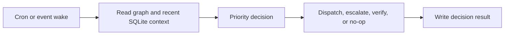

# Decision loop legacy

Active contributors: Saboor

## Purpose

`scripts/runtime/decision_loop/` is an inherited secondary wake, read, decide, act path. The graph-driven [Heartbeat](heartbeat.md) is the primary runtime loop. New scheduling and return behavior should normally be added there rather than extending this parallel control plane.

## How it works

`handle_event()` cleans stale runtime rows, builds a `DecisionContext`, and applies a fixed priority order:

1. Escalate a job running longer than 24 hours.
2. Run recommend-only verification for a graph-complete node without a receipt.
3. Dispatch an eligible pending node through the legacy power.
4. Return a project-complete or nothing-actionable no-op.

Every outcome is validated by a Pydantic result model and persisted in `decision_results`. The context reader separates graph node statuses from runtime job states. Its `accept_node` schema describes an evidence proposal rather than direct graph completion.

The verification integration predates the current bridge and Pi-only live path. It should not be treated as the canonical implementation of the two-lane return evaluator. See [Verification](verification.md).

## Integration points

- Reads graph YAML through `scripts/runtime/heartbeat/graph_reader.py`.
- Reads jobs, events, and results from the same SQLite database as [Intake and control plane](intake-and-control-plane.md).
- Writes action audit rows through `scripts/runtime/results_store.py`.
- Uses powers under `scripts/runtime/decision_loop/powers/` for dispatch and escalation.

## Entry points for modification

Prefer migration into the primary heartbeat, adapter, or return subsystems. If this path must change, preserve its secondary status, typed result contract, project-scoped queries, and prohibition on treating evaluator evidence as graph truth.

## Key source files

| File | Role |
|---|---|
| `scripts/runtime/decision_loop/engine.py` | Wake, priority decision, verification bridge, result persistence |
| `scripts/runtime/decision_loop/context_reader.py` | Graph and SQLite context assembly |
| `scripts/runtime/decision_loop/schema.py` | Typed decision outputs |
| `scripts/runtime/decision_loop/powers/dispatch_next.py` | Legacy dispatch action |
| `scripts/runtime/decision_loop/powers/escalate.py` | Escalation action |
| `scripts/runtime/decision_loop/powers/accept_node.py` | Evidence proposal path |
