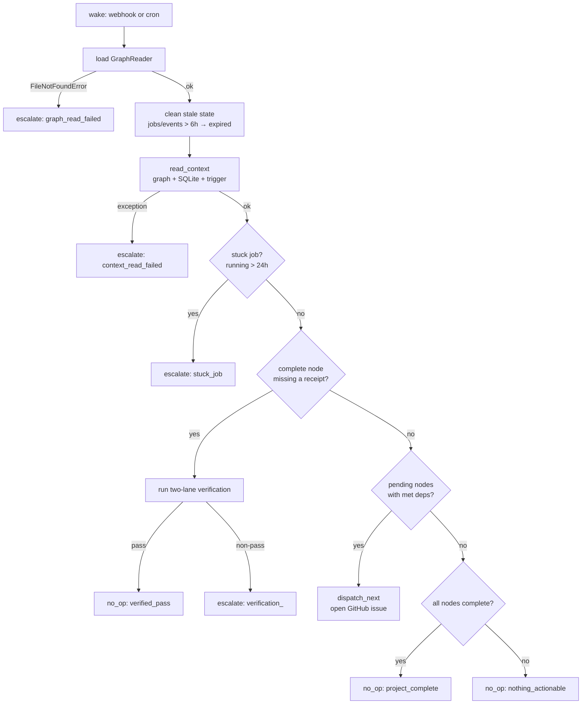

# Decision loop

> Restored from the 2026-07-13 wiki. This describes untriggered legacy code. No webhook, cron, launchd, systemd, or heartbeat path currently calls it. See [Decision loop legacy](decision-loop-legacy.md).

`scripts/runtime/decision_loop/engine.py` is an inherited reasoning layer. If called, it reads project context, applies a fixed priority order, and emits one typed decision. The functions and tests exist, but the repository has no operational trigger for them.

This is not the live layer deciding what runtime does next. The heartbeat owns the operational loop.

## Key source files

| File | Purpose |
|---|---|
| `scripts/runtime/decision_loop/engine.py` | Wake, clean, read context, decide, write result, exit. |
| `scripts/runtime/decision_loop/context_reader.py` | Builds the `DecisionContext` from graph YAML, SQLite rows, and the trigger. |
| `scripts/runtime/decision_loop/schema.py` | Pydantic models enforcing the decision output contract. |
| `scripts/runtime/decision_loop/powers/dispatch_next.py` | Selects the next eligible node and opens a GitHub issue for Jules. |
| `scripts/runtime/decision_loop/powers/escalate.py` | Writes an escalation record and logs it. |
| `scripts/runtime/decision_loop/powers/accept_node.py` | Opens an evidence PR against gddp-config proposing a node complete. |
| `scripts/runtime/heartbeat/graph_reader.py` | Loads project graphs and node YAML from gddp-config. |
| `scripts/runtime/results_store.py` | `write_decision_result` persists each decision to SQLite. |

## Wake cycle

The module exposes two callable entry points that share the same body:

- `handle_event(trigger, project_id)` — accepts an event-shaped trigger.
- `handle_cron(project_id)` — synthesizes a `{"event": "cron"}` trigger and delegates to `handle_event`.

A call runs once and exits. No installed cron or service makes it continuous.

## Context

`read_context` in `scripts/runtime/decision_loop/context_reader.py` assembles a `DecisionContext` from three sources before any decision is made:

1. **Project graph** — `GraphReader` loads the project and every node from `gddp-config`, then buckets nodes into `pending`, `ready`, `complete`, and `deferred`. The buckets mirror the human-owned node status vocabulary; execution states live on jobs and queue records, never on nodes.
2. **SQLite recent rows** — `read_recent_activity` pulls active jobs (dispatched or running), the last 20 results, stale jobs (running > 6 hours), and stale events (received > 6 hours unprocessed).
3. **The trigger** — the event dict that woke the loop, whether a webhook event or a cron tick.

`DecisionContext` is a plain dataclass holding `ProjectState`, `RecentActivity`, and `trigger`. Nothing in it is mutable graph truth; it is a read-only snapshot the engine reasons over.

## Decision priority

The engine applies decisions in a fixed order. The first match wins and the loop exits for that wake.

1. **Clean stale state.** `_clean_stale_state` marks jobs and events older than 6 hours as `expired` before any decision is considered. This runs unconditionally on every wake so stale state never poisons downstream reasoning.
2. **Stuck job.** If any active job has been running more than 24 hours, escalate with `stuck_job` and the job id. This is checked before dispatch so a runaway job does not get a sibling dispatched behind it.
3. **Complete node awaiting verification.** If any node is `complete` but has no receipt in the verification receipt sink, run the two-lane evaluator on it. A pass yields `no_op: verified_pass`; a non-pass escalates with `verification_<verdict>` and the orchestrator's `required_next_action`.
4. **Eligible node to dispatch.** If there are pending nodes whose `depends_on` are all complete, run `dispatch_next` to open a GitHub issue for Jules.
5. **Project complete.** If every node is complete, `no_op: project_complete`.
6. **Nothing actionable.** `no_op: nothing_actionable` — no pending nodes with met dependencies and nothing stuck.

This priority order records the legacy design; it does not govern the live heartbeat.

## The powers

The engine acts through three power modules in `scripts/runtime/decision_loop/powers/`. Each returns a Pydantic result from `schema.py`, so a malformed outcome raises before it reaches SQLite.

### dispatch_next

`scripts/runtime/decision_loop/powers/dispatch_next.py` selects the next eligible node and creates a GitHub issue for Jules via the `gh` CLI. Eligible means status `pending` with every `depends_on` complete. If a job is already active for the project, it returns `escalate: dispatch_blocked` rather than stacking concurrent work. Among multiple eligible nodes it sorts by priority (`high` > `normal` > `low`) and picks the first. The issue body carries the node's goal, why, constraints, acceptance criteria, and the verbatim `node:` / `job:` metadata block the return router later parses. On any failure (gh error, timeout, exception) it escalates rather than crashing the wake.

### escalate

`scripts/runtime/decision_loop/powers/escalate.py` is the catch-all. It constructs an `EscalateResult` with a reason string and logs a warning so journalctl surfaces it. v0 writes to SQLite and logs only; there is no Telegram or WhatsApp path. Escalation is also the engine's universal error handler: a graph read failure, a context read failure, an unhandled exception, and a failed dispatch all become escalate results with a specific reason, so the wake always produces a persisted, typed outcome.

### accept_node

`scripts/runtime/decision_loop/powers/accept_node.py` can call the inactive `open_evidence_pr` path. Because nothing operational invokes this decision loop, this is retained code rather than a current graph-update workflow.

## Output contract

Every decision is a `DecisionResult`, a union of `DispatchResult`, `EscalateResult`, `ReviewResult`, `AcceptResult`, and `NoOpResult` from `scripts/runtime/decision_loop/schema.py`. Pydantic validates the shape before the engine writes it via `write_decision_result`, so no malformed row reaches the `decision_results` table. The `ok` field is `True` for all typed results including escalations; the CLI returns non-zero only on a hard failure, so cron surfaces real breakage without noisy exit codes on ordinary escalations.

## Related pages

- [overview/architecture.md](../overview/architecture.md) — full system flow, including where the decision loop sits relative to intake and the heartbeat.
- [systems/return-router.md](return-router.md) — what happens after the loop dispatches work and the PR comes back.
- [systems/intake-server.md](intake-server.md) — the live webhook receiver; it does not call this legacy loop.
- [systems/verification.md](../systems/verification.md) — the two-lane evaluator the loop runs on complete nodes.
- [systems/state-persistence.md](../systems/state-persistence.md) — the SQLite tables the loop reads and writes.
- [systems/heartbeat.md](../systems/heartbeat.md) — the live operational loop that replaced this path.
