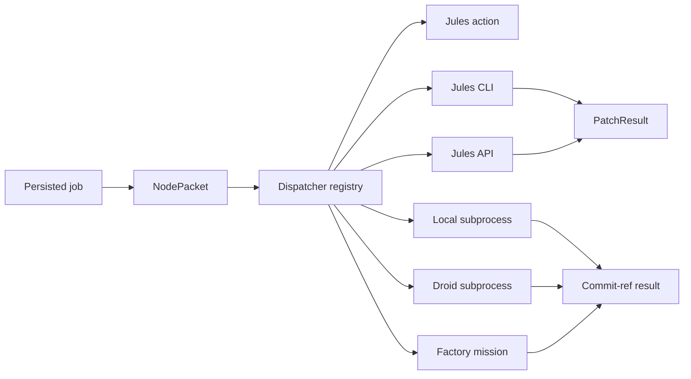

# Executor adapters

Active contributors: Saboor

## Purpose

Executor adapters isolate the runtime from executor-specific transport and lifecycle details. The [Heartbeat](heartbeat.md) builds one immutable [NodePacket](../primitives/node-packet.md), then calls the same dispatch, status, collect, and cancel contract for Jules, local subprocesses, Droid, and Factory mission.

Executor choice never changes graph authority. Adapters return work and evidence; they do not mark nodes complete.

## Directory layout

| Path | Role |
|---|---|
| `scripts/adapters/executor_protocol.py` | Neutral packet, session, status, patch, dispatch, and engagement contracts |
| `scripts/runtime/heartbeat/dispatcher.py` | Adapter registry, configuration preflight, packet decoding, and routing |
| `scripts/adapters/jules_action_adapter.py` | Mediated GitHub issue path |
| `scripts/adapters/jules_cli_adapter.py` | Direct Jules CLI lifecycle |
| `scripts/adapters/jules_api_adapter.py` | Direct Jules REST API lifecycle |
| `scripts/adapters/local_subprocess_adapter.py` | Durable local process spool and Droid specialization |
| `scripts/adapters/mission_adapter.py` | Multi-node Factory mission adapter |

## Key abstractions

| Abstraction | Contract |
|---|---|
| `NodePacket` | Frozen attempt identity, intent, criteria, constraints, artifacts, findings, and expected base |
| `SessionRef` | Durable executor name plus executor-specific session ID |
| `SessionStatus` | Normalized asynchronous state such as `running`, `awaiting_reply`, `completed`, or `failed` |
| `PatchResult` | Either a patch handoff or a commit-ref handoff, with optional feature and evidence identity |
| `DispatchResult` | Direct session receipt or mediated issue URL |
| `EngagementDispatchResult` | Shared session receipt for an ordered group of node attempts |
| `ExecutorAdapter` | `dispatch`, `status`, `collect`, `cancel`, plus optional engagement operations |

`NodePacket` recursively freezes JSON-compatible nested values and serializes deterministically. Retry findings remain part of the unchanged node attempt contract rather than becoming a new node definition.

## How it works

### Dispatcher

`ADAPTERS` contains lifecycle-conforming direct adapters: `jules_api`, `jules_cli`, `local_subprocess`, `droid`, and `factory_mission`. `MEDIATED_ADAPTERS` contains `jules`, the GitHub issue path that does not expose a pollable direct session.

`GDDP_EXECUTOR_OVERRIDE` can reroute a canary without mutating graph configuration. Preflight instantiates the selected adapter early and reports configuration errors before a job consumes capacity. Local transports receive the resolved checkout as `cwd`; remote transports receive only the repository name.

Engagement dispatch is opt-in. The dispatcher requires one executor, unique node IDs, and topological order among selected dependencies before sending several packets to one adapter.

### Jules action

`JulesActionAdapter` creates a GitHub issue labeled `jules`. Its body renders node intent, criteria, constraints, required artifacts, retry findings, and a required metadata block containing node, job, attempt, and execution attempt IDs. The resulting issue URL is the mediated dispatch receipt.

The adapter obtains a token from `GITHUB_TOKEN`, `GH_TOKEN`, or `gh auth token`. This path has no direct polling or collection lifecycle; merged PR webhooks return through [Return and review](return-and-review.md).

### Jules CLI

`JulesCliAdapter` uses:

- `jules remote new` to create a session and parse its long numeric ID.
- `jules remote list --session` to normalize status.
- `jules remote pull --session <id>` without `--apply` to retrieve a patch.

Known status text maps to completed, failed, or running. An awaiting-feedback line becomes `needs_operator`. A successful list that lacks the target ID becomes `missing`; command failures become `poll_error`. Cancellation is explicitly unsupported.

### Jules API

`JulesApiAdapter` resolves a repository source from the API, creates an `AUTO_CREATE_PR` session, and maps documented API states into the neutral lifecycle. `AWAITING_USER_FEEDBACK` becomes machine-answerable `awaiting_reply`; plan approval and paused states become `needs_operator`.

Collection scans paginated activities and selects the final ChangeSet git patch with its declared base commit. The reconciler applies that patch in an isolated worktree. Credentials come from `JULES_API_KEY` or a command configured by `GDDP_JULES_KEY_CMD`.

### Local subprocess

`LocalSubprocessAdapter` creates a unique attempt directory under `GDDP_LOCAL_SUBPROCESS_SPOOL_DIR`. It writes:

- `packet.json` with the deterministic packet.
- `command.json` with argv and cwd.
- `supervisor.pid` and later `pid`.
- captured `stdout` and `stderr`.
- atomic `exit.json` as durable terminal state.

A detached Python supervisor starts the configured argv with `packet.json` on stdin. The launch handshake prevents the child from running before `supervisor.pid` is durable. Status is reconstructed from spool files and process liveness, so it survives heartbeat restarts.

Successful stdout must contain a `gddp.local_result.v1` commit-ref handoff. Collection returns `result_commit_sha`, `result_ref`, and an optional preserved worktree path. A missing `exit.json` after both process identities disappear is a plumbing failure, not a normal executor result.

The local argv comes from `GDDP_LOCAL_SUBPROCESS_ARGV`; the spool path is mandatory. This is why armed hosts must use the mini-heartbeat kit rather than invoking the runner directly.

### Droid

`DroidSubprocessAdapter` inherits the local spool and commit-ref transport but records executor identity `droid`. Its default argv runs `droid exec --auto high` through `scripts/local_agent_executor.py`, with the NodePacket delivered on stdin and a system prompt that forbids graph and runtime database mutation.

`GDDP_DROID_SUBPROCESS_ARGV` overrides the default argv. Model selection remains host configuration, not a graph or adapter concern.

### Factory mission

`MissionAdapter` is the only current engagement-capable adapter. It groups ordered packets with a common base into one mission session and fans collection back out by exact feature ID. See [Factory mission](factory-mission.md).

## Integration points

- [Heartbeat](heartbeat.md) owns reservation, polling cadence, retry policy, collection, and database transitions.
- [Verification](verification.md) judges the exact commit reconstructed or returned by an adapter.
- [Return and review](return-and-review.md) handles the mediated GitHub issue and merged PR path.
- [Deployment](../deployment/index.md) supplies production environment and process topology.

## Entry points for modification

- Add neutral fields in `scripts/adapters/executor_protocol.py` only when every executor can receive or return them truthfully.
- Register direct adapters in `scripts/runtime/heartbeat/dispatcher.py`; do not special-case lifecycle logic in the heartbeat.
- Preserve fail-closed status parsing. Unknown terminal output must not be guessed as success.
- Keep `collect()` retrieval-only. Patch application, ancestry checks, commit creation, and evaluation belong to the reconciler.
- For local executors, preserve the durable spool and commit-ref handoff rather than relying on in-memory `Popen` state.

## Key source files

| File | Key symbols |
|---|---|
| `scripts/adapters/executor_protocol.py` | `NodePacket`, `SessionRef`, `PatchResult`, `ExecutorAdapter` |
| `scripts/runtime/heartbeat/dispatcher.py` | `ADAPTERS`, `MEDIATED_ADAPTERS`, `dispatch`, `dispatch_engagement` |
| `scripts/adapters/jules_action_adapter.py` | `JulesActionAdapter` |
| `scripts/adapters/jules_cli_adapter.py` | `JulesCliAdapter` |
| `scripts/adapters/jules_api_adapter.py` | `JulesApiAdapter` |
| `scripts/adapters/local_subprocess_adapter.py` | `LocalSubprocessAdapter`, `DroidSubprocessAdapter`, `read_local_subprocess_status` |
