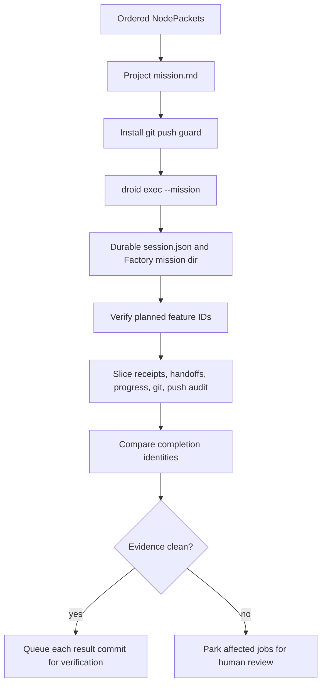

# Factory mission

Active contributors: Saboor

## Purpose

The Factory mission adapter executes a bounded, ordered group of node attempts in one `droid exec --mission` engagement. It preserves node identity through projection, process state, receipts, git history, push audit, and feature-scoped evidence manifests. Any disagreement is retained and routed to human review rather than normalized into success.

Factory mission is an executor transport, not a graph authority. Its feature completion, receipts, and git verification remain evidence. See [Doctrine](../background/doctrine.md).

## Directory layout

| Path | Role |
|---|---|
| `scripts/adapters/mission_adapter.py` | Engagement lifecycle, process record, status, collection, cancellation |
| `scripts/adapters/mission_projection.py` | Topological mission text and exact feature-ID verification |
| `scripts/adapters/mission_evidence.py` | Per-feature evidence slicing, cross-checks, completion identity, quarantine reasons |
| `scripts/adapters/mission_git_verify.py` | Commit, ancestry, reachability, trailer, and engagement-history verification |
| `scripts/adapters/mission_push_guard.py` | PATH shim, pre-push hook, exact push policy, append-only audit |
| `scripts/runtime/heartbeat/completion_discipline.py` | Atomic replay deduplication and completion conflict quarantine |
| `scripts/runtime/gates.py` | Per-node provisional gate tokens used as mission admission evidence |

## Key abstractions

| Abstraction | Meaning |
|---|---|
| engagement | One mission process, branch, mission directory, and durable session record spanning one or more nodes |
| projected feature | One exact graph node represented in `mission.md` with its own commit and receipt contract |
| `PlanningVerification` | Exact ordered comparison between demanded node IDs and Factory's planned feature IDs |
| `CollectedNodeEvidence` | One feature's manifest path, git boundary, worker identity, completion identity, and review disposition |
| completion identity | Stable `<mission-id>:<feature-id>:<worker-session-id>` plus SHA-256 envelope digest |
| quarantine | Preserved evidence whose identity, git claims, push behavior, or channels conflict and therefore requires human review |

## How it works



### Projection

`project_mission()` topologically orders the selected nodes while ignoring dependencies outside the selection. Duplicate IDs or a cycle are rejected. The generated mission demands exactly one feature per node, in exact order, without splitting, merging, renaming, or adding features.

Each feature carries its source title, intent, acceptance criteria, constraints, and required artifacts. Its execution contract requires:

1. Capture the starting SHA.
2. Make exactly one commit.
3. Add exactly the expected `GDDP-Node-Id: <node-id>` commit trailer.
4. Run `gddp receipt --node-id ... --base ... --result ...`.
5. Push immediately and only to `origin` at the engagement branch.
6. Avoid every force-push form.
7. Verify the commit is reachable from `origin/<engagement-branch>` before reporting success.

After the mission runs, `verify_planned_feature_ids()` reads Factory's `features.json`. Any mismatch in IDs or order parks the engagement results for review.

### Dispatch and durable process state

`MissionAdapter.dispatch_engagement()` requires a resolved target checkout, unique feature IDs, and no more than one non-null expected base. If local `HEAD` disagrees with that expected base, dispatch fails before process creation.

The adapter creates a random engagement ID and branch `gddp/<engagement-id>`. Under the session root it writes `mission.md`, captures stdout and stderr, configures receipt and push-audit paths, and launches:

```text
droid exec --mission -f <mission.md> --auto high -w <engagement-branch>
```

Mission-directory discovery is serialized with both an in-process lock and `flock`, preventing concurrent dispatches from claiming the same newly created Factory directory. `session.json` records mission directory, PID, process identity, return code, branch, feature IDs, repository, logs, receipt path, audit path, and cancellation state.

Status does not trust Factory `state.json` alone. A live process is checked against its recorded OS identity to detect PID reuse. Completion requires a dead process with a zero or unknown return code and a final `mission_completed` event in `progress_log.jsonl`. Otherwise the result is `failed` or `crashed`, with stderr or stdout tail included in the error.

### Push guard

`install_git_push_guard()` prepends a guarded `git` executable to `PATH` and injects a `core.hooksPath` pre-push hook through inherited Git configuration. The only accepted push argument sequence is:

```text
git push origin HEAD:refs/heads/gddp/<engagement-id>
```

Leading `+` refspecs and short or long force options are rejected. Allowed and rejected attempts are appended under a file lock to `push-audit.jsonl`, including argv, commit SHA, return code, timestamp, and remote refs containing the commit.

The guard is intentionally not treated as complete containment. An absolute Git executable combined with `-c core.hooksPath=/dev/null` can bypass both environment controls. Collection therefore performs post-hoc protected-branch detection against live `git ls-remote` tips first, cached `origin/*` refs second, and local protected branch tips last.

### Evidence collection

`collect_mission_evidence()` reads several independent channels:

- `state.json` for mission identity.
- `features.json` for observed feature IDs.
- `handoffs/*.json` for worker commit handoffs.
- `progress_log.jsonl` for worker start and terminal events.
- the runtime receipt JSONL written by `gddp receipt`.
- real git objects, branches, ancestry, commit trailers, and remote reachability.
- push-audit records.
- process exit and log paths.
- observed dirty worktree state.

For each demanded feature it writes a separate manifest. Missing channels, conflicting receipts, feature-ID drift, handoff failures, incomplete progress, dirty crash residue, and cross-channel disagreements become explicit review reasons.

Receipt self-description is checked against the repository: `result` must match observed `git_head`; `git_toplevel` must share the same git common directory; and the claimed branch must contain the result. `verify_git_result()` separately requires a commit object, base ancestry, engagement-branch reachability, origin reachability when configured, and exactly one matching node trailer.

At the engagement level, `verify_engagement_history()` requires the base-to-branch range to contain exactly one commit per demanded node and the trailers to match demanded IDs in topological order.

Feature push verification requires an allowed, successful, exact-shape audit record for that commit, proof that `origin/<engagement-branch>` contains it, and a push timestamp no later than feature completion.

### Completion discipline

The evidence manifest derives a stable completion ID and a digest over the normalized feature envelope. `submit_completion()` compares them inside `BEGIN IMMEDIATE`:

- First sighting stores the identity and evidence.
- An exact replay reuses the first stored commit and evidence.
- The same ID with a different digest quarantines every involved session and routes every involved job to `awaiting_review`.

Duplicate handling preserves an earlier quarantine disposition. Replaying a completion cannot turn quarantined evidence into evaluable success.

### Reconciliation

The heartbeat polls one engagement once, then joins returned `PatchResult` values to reserved jobs by exact `feature_id`. A count or ID mismatch routes the whole affected group to review.

Clean feature results must expose a result commit and engagement ref. The reconciler verifies branch resolution, result reachability, and expected-base ancestry before recording `collected` and queuing [Verification](verification.md). Review-required or incomplete results are preserved in session rows and sent directly to `awaiting_review`.

## Integration points

- [Heartbeat](heartbeat.md) groups jobs by executor and common expected base, then fans returned features back to jobs.
- [Executor adapters](executor-adapters.md) defines the engagement and patch-result contracts.
- [Verification](verification.md) receives the feature result commit, evidence manifest hash, and mission receipt ID as provenance.
- `scripts/runtime/gates.py` writes `.gddp/gates/<node>.token` when qualifying evidence marks a dependency provisional.

## Entry points for modification

- Change mission wording and per-feature obligations in `scripts/adapters/mission_projection.py`.
- Change lifecycle and Factory process interpretation in `scripts/adapters/mission_adapter.py`; retain durable process identity and progress-log checks.
- Add evidence channels in `scripts/adapters/mission_evidence.py`; never replace a disagreement with a preferred channel silently.
- Change git admissibility in `scripts/adapters/mission_git_verify.py`.
- Change prevention policy in `scripts/adapters/mission_push_guard.py`, while preserving post-hoc detection for bypassable environment controls.
- Change replay behavior in `scripts/runtime/heartbeat/completion_discipline.py`; keep comparison atomic and quarantine conflicting envelopes.

## Key source files

| File | Key symbols |
|---|---|
| `scripts/adapters/mission_adapter.py` | `MissionAdapter`, `dispatch_engagement`, `collect_engagement` |
| `scripts/adapters/mission_projection.py` | `project_mission`, `verify_planned_feature_ids` |
| `scripts/adapters/mission_evidence.py` | `collect_mission_evidence`, `CollectedNodeEvidence` |
| `scripts/adapters/mission_git_verify.py` | `verify_git_result`, `verify_engagement_history` |
| `scripts/adapters/mission_push_guard.py` | `install_git_push_guard`, `run_guarded_git`, `run_pre_push_hook` |
| `scripts/runtime/heartbeat/completion_discipline.py` | `submit_completion` |
