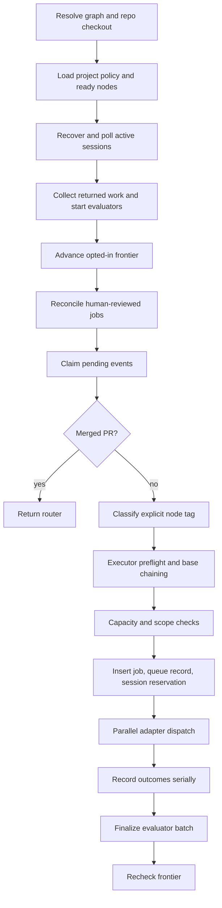

# Heartbeat

Active contributors: Saboor

## Purpose

The heartbeat is the primary graph-driven scheduler and reconciliation loop. One tick first recovers and collects existing executor work, then plans new work from durable events, dispatches reserved attempts concurrently, and serializes all SQLite writes on the coordinator thread.

The heartbeat never marks a node `complete`. Evaluation can produce evidence and the system writer can mark a qualifying node `provisional`; human acceptance remains the only path to completion. See [Doctrine](../background/doctrine.md).

On an armed production host, enter this system only through `deploy/mini-heartbeat/bin/`. The kit sources `deploy/mini-heartbeat/env/gddp.env` through `deploy/mini-heartbeat/bin/common.sh`, supplying the local executor argv and spool configuration. A raw `python -m scripts.runtime.heartbeat.runner` call bypasses that contract.

## Directory layout

| Path | Role |
|---|---|
| `scripts/runtime/heartbeat/runner.py` | Tick coordinator, event claiming, capacity reservation, parallel dispatch, outcome recording |
| `scripts/runtime/heartbeat/graph_reader.py` | Reads project and node YAML from the external `gddp-config` checkout |
| `scripts/runtime/heartbeat/classifier.py` | Maps explicitly tagged `issue.opened` events to ready nodes |
| `scripts/runtime/heartbeat/scope_checker.py` | Rejects duplicate active work and unsatisfied dependencies |
| `scripts/runtime/heartbeat/job_factory.py` | Builds persistent job dictionaries and artifact directories |
| `scripts/runtime/heartbeat/dispatcher.py` | Converts jobs to [NodePacket](../primitives/node-packet.md) values and selects adapters |
| `scripts/runtime/heartbeat/state_recorder.py` | Centralizes heartbeat SQLite mutations |
| `scripts/runtime/heartbeat/reconciler.py` | Polls, collects, commits, evaluates, retries, and cancels executor sessions |
| `scripts/runtime/heartbeat/frontier.py` | Optionally advances one newly eligible graph layer and injects dispatch events |
| `scripts/runtime/heartbeat/provisional_gate.py` | Writes the scheduler-visible `provisional` status for qualifying evaluation evidence |
| `scripts/runtime/heartbeat/completion_discipline.py` | Deduplicates or quarantines executor completion identities |

## Key abstractions

| Abstraction | Meaning |
|---|---|
| `GraphReader` | Cached reader for `project.yaml` summaries and per-node YAML details |
| `PlannedDispatch` | A durable reservation joining an event, classification, job, and executor-session row |
| `DispatchOutcome` | Worker result returned to the coordinator for serialized persistence |
| `EvaluationBatch` | Bounded verifier thread pool whose workers never receive the SQLite connection |
| executor session | One immutable job attempt record with expected base, executor identity, lifecycle state, and returned evidence |
| provisional node | Evaluator-passed scheduling evidence awaiting human acceptance, not completed graph truth |

## Full tick lifecycle

### 1. Resolve configuration and checkout

`run_heartbeat()` constructs `GraphReader`, whose config resolution order is explicit `config_path`, `GDDP_CONFIG_PATH`, then the sibling `gddp-config` checkout. The project YAML supplies the repository and execution policy. If `repo_path` was not passed, `scripts/runtime/repo_resolver.py` resolves the graph's `repo:` value to a local git checkout. An unresolved checkout is logged and causes reconciliation and local dispatch to be skipped rather than silently using the wrong directory.

`execution_policy.max_concurrent_jobs` is an optional positive integer. When absent, dispatch has no configured job cap and evaluation uses the default capacity of two workers.

### 2. Reconcile existing sessions before new work

`reconcile_sessions()` recovers `dispatching` reservations older than 30 minutes as `dispatch_failed`, scoped to the current repository. It then groups active sessions by executor and remote session ID, which permits a Factory mission engagement to be polled and collected once for several jobs.

For a normal session, the reconciler:

1. Polls the adapter using a durable `SessionRef`.
2. Leaves transient `poll_error` results unchanged for the next tick.
3. Answers one `awaiting_reply` state with the standing packet-authority reply, then escalates repeated questions to `needs_operator`.
4. Parks authentication failures in `needs_operator` without consuming attempt budget.
5. Retries ordinary failures against the work-attempt budget and pre-execution plumbing failures against a separate plumbing budget.
6. Collects successful work either as a local commit ref or as a remote patch.

Commit-ref results must resolve through their named ref and descend from the expected base. Patch results are applied and committed in an isolated worktree rooted at the patch's declared base when available. Every collected commit gets a durable `gddp/result-<job>-<session>` ref before evaluation.

Collected sessions are durable resume points. If the process stops after collection but before evaluation finishes, the next tick queues evaluation directly from `result_commit_sha` instead of recollecting or creating another commit.

### 3. Run evaluation concurrently with planning

The reconciler queues plain-data `PendingEvaluation` objects and starts `verify_job_return()` workers. The heartbeat continues into frontier and dispatch planning while evaluator subprocesses run. Worker threads do not write SQLite. `EvaluationBatch.finalize()` drains futures and performs result, session, and job writes on the coordinator thread.

Every evaluator outcome, including evaluator errors, routes the job to `awaiting_review`. A qualifying pass may invoke `maybe_mark_provisional()`, but that writer never writes `complete`. See [Verification](verification.md).

### 4. Advance the scheduling frontier

Projects opt in with `execution_policy.frontier_auto_advance: true`. `advance_frontier()` takes one graph snapshot and moves eligible `pending` nodes to `ready` when all dependencies are `complete` or `provisional`. It skips `human_gate: true` nodes, nodes with active jobs, and nodes with an already pending frontier event.

Each transition injects a synthetic `issue.opened` event with source `frontier_auto`. It therefore passes through the same classifier, scope, capacity, reservation, and dispatch path as an operator dispatch. One snapshot means one graph layer advances per pass.

### 5. Drain reviewed runtime jobs

Human acceptance changes graph files, not the runtime database. `reconcile_reviewed_jobs()` maps graph `complete` to runtime `accepted` and graph `deferred` to runtime `deferred` for jobs in `awaiting_review`. It does not infer rejection from graph `ready`, because that status is ambiguous.

### 6. Claim and plan events

The planner adopts unowned events whose `repo` matches the project. It also reclaims `claimed` events after a 30-minute lease. Each event is atomically moved to `claimed`; a competing heartbeat that loses the update race skips it.

Merged PR events are sent to `scripts/runtime/return_router.py`. Forward dispatch accepts only `issue.opened` and requires an explicit `node: <id>` tag in the URL, branch, issue title, or issue body. There is no guessed-node fallback.

For a matched ready node, planning performs:

1. Adapter configuration preflight.
2. Expected base capture from local `HEAD`.
3. Provisional dependency base chaining. One provisional dependency uses its latest recorded result commit; multiple provisional dependencies defer because the runtime has no merge mechanism.
4. A `BEGIN IMMEDIATE` capacity reservation lock.
5. Duplicate-work and dependency scope checks.
6. Insertion of the job, queue record, and `dispatching` executor-session reservation.

Reservations commit before worker dispatch starts, so overlapping heartbeat processes see consumed capacity immediately.

### 7. Dispatch and persist outcomes

The coordinator groups engagement-capable jobs by executor and expected base, bounds group size using mission policy, and dispatches groups in a thread pool. Other adapters receive one job per future. See [Executor adapters](executor-adapters.md) and [Factory mission](factory-mission.md).

After all futures return, `_record_outcomes()` processes reservations sequentially. A successful direct dispatch records its `SessionRef`; a mediated Jules action stores the issue URL and marks the session `mediated`. Failed dispatches become `dispatch_failed`, and their jobs and queue records become `failed`. A result arriving after its reservation left `dispatching` is ignored and the remote session is cancelled when supported.

### 8. Finalize evaluation and recheck frontier

The `finally` block always finalizes evaluator futures before the database closes. Because finalization may have written new provisional states, the reader cache is invalidated and the frontier is checked again. Event deduplication makes the recheck harmless when no node became eligible.

## Integration points

- [Executor adapters](executor-adapters.md) implement dispatch, polling, collection, and cancellation.
- [Verification](verification.md) evaluates exact returned commits in isolated worktrees.
- [Return and review](return-and-review.md) handles merged PR events and persists review receipts.
- [Intake and control plane](intake-and-control-plane.md) supplies events and owns operator-facing job state.
- `gddp-config` remains the human-owned graph source. The runtime reads and narrowly writes scheduling statuses but does not decide completion.

## Entry points for modification

- Add an execution mode in `scripts/runtime/heartbeat/graph_reader.py`, register its adapter in `scripts/runtime/heartbeat/dispatcher.py`, and preserve the neutral protocol.
- Change event eligibility in `scripts/runtime/heartbeat/classifier.py`; keep explicit node binding and auditable ignores.
- Change capacity or reservation behavior in `scripts/runtime/heartbeat/runner.py`; preserve the `BEGIN IMMEDIATE` reservation boundary.
- Change return-state transitions in `scripts/runtime/heartbeat/reconciler.py` and centralize SQLite writes in `scripts/runtime/heartbeat/state_recorder.py`.
- Change provisional scheduling in `scripts/runtime/heartbeat/provisional_gate.py` or `scripts/runtime/heartbeat/frontier.py`; never turn evaluation into completion authority.

## Key source files

| File | Key symbols |
|---|---|
| `scripts/runtime/heartbeat/runner.py` | `run_heartbeat`, `_plan_dispatches`, `_execute_dispatches`, `_record_outcomes` |
| `scripts/runtime/heartbeat/reconciler.py` | `reconcile_sessions`, `EvaluationBatch`, `_handle_completed`, `_finalize_evaluation` |
| `scripts/runtime/heartbeat/dispatcher.py` | `ADAPTERS`, `dispatch`, `dispatch_engagement`, `_build_node_packet` |
| `scripts/runtime/heartbeat/frontier.py` | `advance_frontier` |
| `scripts/runtime/heartbeat/provisional_gate.py` | `provisional_eligible`, `maybe_mark_provisional` |
| `scripts/runtime/heartbeat/state_recorder.py` | reservation, retry, and job-state mutation helpers |
