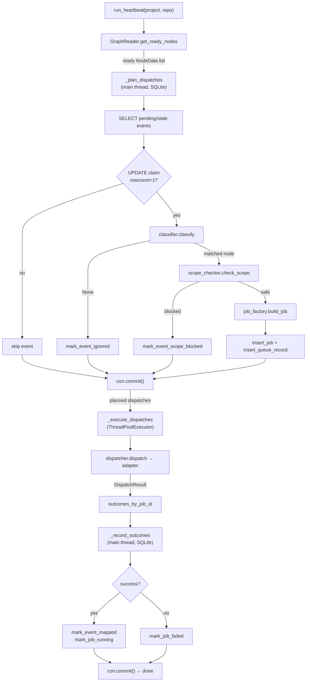

# Heartbeat

The heartbeat is the runtime's forward dispatch loop. It reads the project graph, finds ready nodes, fetches pending events from SQLite, atomically claims each event on the main thread, classifies it, scope-checks it, builds a job payload, dispatches the job to an executor adapter in a parallel worker thread, and records the outcome back to SQLite. Everything in the heartbeat is structured around a strict three-phase split so that the only SQLite writes happen on the main thread, and the only network I/O happens in worker threads.

The entry point is `scripts/runtime/heartbeat/runner.py`. Run it as a module from the runtime root:

```bash
python3 -m runtime.heartbeat.runner \
    --project vault-doctor \
    --repo skchaudr/vault-doctor \
    [--config-path /path/to/gddp-config]
```

## Three-phase architecture

The heartbeat is deliberately split into three phases that run strictly in order. Each phase has a clear contract about what it may touch.

### Phase A — plan (`_plan_dispatches`)

Runs entirely on the main thread with a single SQLite connection. For each pending event it:

1. **Fetches events.** Selects rows from `events` with `status = 'received'`, plus stale `claimed` rows older than 30 minutes (a heartbeat that crashed mid-claim gets re-eligible). Events arrive from intake with `project_id = NULL`; the runner adopts unowned events whose `repo` matches its `--repo` argument.
2. **Atomically claims.** Runs an `UPDATE ... WHERE status = 'received'` (or stale-claimed) and checks `rowcount == 1`. A concurrent runner that read the same row loses the race and skips. Claiming also stamps `project_id` onto the event.
3. **Classifies.** `classifier.classify` maps the event to a ready node. Only `issue.opened` events with an explicit `node: <id>` tag (in `url`, `branch`, or the issue title/body from the raw payload) naming a ready node are dispatchable. There is no fallback guess: repos are public, so an untagged issue must never spend executor budget on a guessed node. Unmatched events are marked `ignored` and auditable.
4. **Scope-checks.** `scope_checker.check_scope` rejects a node if any job for it is already `ready`, `running`, or `awaiting_review`, or if any `depends_on` node is not `complete` in `project.yaml`. This is the gate that prevents the infinite dispatch loop the project hit in Phase 3-4.
5. **Builds the job and reserves it.** `job_factory.build_job` produces a dict ready to `INSERT` into `jobs`, and `state_recorder` writes the job and a `queue_records` row so other heartbeats see it immediately.

Phase A ends with a single `con.commit()` so all reservation rows are durable before any worker thread starts.

### Phase B — execute (`_execute_dispatches`)

Worker threads run `dispatcher.dispatch(job, repo)` in parallel via `ThreadPoolExecutor` (capped at `min(32, max(1, n))` workers). Each thread constructs the adapter for the job's `executor` field (today only `jules`), builds an adapter payload from the job dict, and calls `adapter.dispatch`. Threads return a `DispatchResult` with `success`, `issue_url`, and `error`. No SQLite access happens here — outcomes are collected into a `dict[job_id, DispatchOutcome]` on the main thread via `as_completed`.

### Phase C — record (`_record_outcomes`)

Back on the main thread, outcomes are written sequentially. A successful dispatch marks the event `mapped` and the job `running`; a failed dispatch marks the job `failed` and leaves the event in its classified state for a later retry pass. One final `con.commit()` makes the new state visible to every other process.

## Flow diagram



## Modular components

Each collaborator lives in its own module under `scripts/runtime/heartbeat/`. The runner orchestrates them; it owns no business logic of its own.

### graph_reader

`scripts/runtime/heartbeat/graph_reader.py` loads `gddp-config` YAML into `NodeData` and `ProjectGraph` dataclasses. Config path resolves by arg > `GDDP_CONFIG_PATH` env var > sibling `../gddp-config` directory convention. `get_ready_nodes(project_id)` returns nodes whose `project.yaml` summary has `status: 'ready'` and that have a node YAML file; it does not verify `depends_on` here (that is `scope_checker`'s job). Project and node loads are cached to avoid redundant file I/O within a heartbeat. See [graph-reader.md](graph-reader.md) for the full reference.

### classifier

`scripts/runtime/heartbeat/classifier.py` maps an event to a ready node. The only dispatchable event type is `issue.opened`. It scans `url`, `branch`, and the issue `title`/`body` (loaded from the raw payload on disk) for a `node: <id>` tag and requires that id to name a ready node. On a match it returns a classification dict with `matched_node_id`, `executor_recommendation` (the first entry in `allowed_execution_modes`, preserving graph ordering), `requires_code_execution`, and `requires_human_review`. No tag, or a tag for a non-ready node, returns `None` and the event is ignored — deliberately, because public repos must not trigger guessed dispatch.

### scope_checker

`scripts/runtime/heartbeat/scope_checker.py` is the duplicate-dispatch gate. `check_scope` returns a `ScopeCheckResult` that is safe only when (1) no job for this node is already `ready`, `running`, or `awaiting_review`, and (2) every `depends_on` node is `complete` in `project.yaml`. `awaiting_review` counts as active: a node whose work sits in the human review queue must not be dispatched again by a later heartbeat. On a block, the event is marked `scope_blocked` with the reason recorded in its `classification` JSON.

### job_factory

`scripts/runtime/heartbeat/job_factory.build_job` is the single place job payloads are constructed. It generates a timestamped `job_id`, creates an artifacts directory under `jobs/<job_id>/`, serializes `constraints` and `acceptance_criteria` to JSON strings for storage, and carries `_required_artifacts` and `_previous_findings` through as adapter-only fields that are not stored on the `jobs` row directly.

### dispatcher

`scripts/runtime/heartbeat/dispatcher.py` routes a job to the right adapter by `executor` key. Today only `jules` is registered (see [executor-adapters.md](executor-adapters.md)). `dispatch` returns a `DispatchResult(success, issue_url, error)`; the runner never inspects adapter internals. Adapter payloads include retry-loop fields (`_previous_findings`, `attempt`) so the adapter can inject findings into the issue body on re-dispatch.

### state_recorder

`scripts/runtime/heartbeat/state_recorder.py` is the only module that writes to SQLite from the heartbeat. Each function is a thin named mutation: `mark_event_ignored`, `mark_event_classified`, `mark_event_scope_blocked`, `mark_event_mapped`, `insert_job`, `insert_queue_record`, `mark_job_running`, `mark_job_failed`. No business logic lives here — the runner decides which mutation to call and in what order.

## Key source files

| File | Responsibility |
|---|---|
| `scripts/runtime/heartbeat/runner.py` | Entry point; three-phase orchestration; atomic event claims; parallel dispatch; outcome recording. |
| `scripts/runtime/heartbeat/graph_reader.py` | Loads `gddp-config` YAML into `NodeData` / `ProjectGraph`; caches loads; resolves config path by arg > env > sibling dir. |
| `scripts/runtime/heartbeat/classifier.py` | Maps `issue.opened` events to ready nodes via explicit `node:` tags; picks executor from `allowed_execution_modes`. |
| `scripts/runtime/heartbeat/scope_checker.py` | Duplicate-dispatch and dependency gate; treats `awaiting_review` as active. |
| `scripts/runtime/heartbeat/job_factory.py` | Builds the job dict and artifacts directory; serializes criteria for storage. |
| `scripts/runtime/heartbeat/dispatcher.py` | Routes jobs to executor adapters; builds adapter payloads including retry-loop fields. |
| `scripts/runtime/heartbeat/state_recorder.py` | All SQLite mutations for the heartbeat; no business logic. |

## Concurrency and safety notes

- **Atomic claims.** The `UPDATE ... WHERE status='received'` claim with `rowcount == 1` check is the only thing preventing two heartbeat processes from dispatching the same event. A losing runner skips cleanly.
- **Stale claim recovery.** A `claimed` row older than 30 minutes is treated as eligible again, so a crashed heartbeat does not strand events.
- **Main-thread SQLite only.** All DB writes happen in Phases A and C on the main thread. Worker threads only do network I/O against the executor adapter.
- **Pre-dispatch reservation.** Jobs and queue rows are inserted in Phase A before any dispatch, so a later heartbeat's scope check sees them as active.

## Related pages

- [overview/architecture.md](../overview/architecture.md) — system architecture with Mermaid diagrams.
- [return-router.md](return-router.md) — receipt-only merged-PR return handling.
- [executor-adapters.md](executor-adapters.md) — Jules action adapter and the dispatch contract.
- [decision-loop.md](decision-loop.md) — event-driven reasoning layer that wakes on webhook or cron.
- [graph-reader.md](graph-reader.md) — config-driven YAML graph reader reference.
