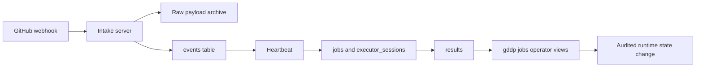

# Intake and control plane

Active contributors: Saboor

## Purpose

This subsystem receives GitHub events, stores normalized runtime state in SQLite, and exposes operator inspection and bounded runtime-state changes. It owns job and queue state only. It never writes graph node status.

## Directory layout

| Path | Role |
|---|---|
| `scripts/intake_server.py` | Flask webhook endpoint, signature validation, raw payload archive, event normalization |
| `scripts/init_db.py` | Canonical SQLite schema creation and idempotent migrations |
| `scripts/jobs_status.py` | Job, result, decision, and executor-attempt inspection plus audited runtime-state changes |
| `db/queue.db` | Runtime SQLite database, rooted through `GDDP_RUNTIME_ROOT` |
| `events/raw/` | Archived raw webhook payloads |
| `jobs/` | Per-job artifacts and local executor spool data |

## Key abstractions

| Object | Responsibility |
|---|---|
| event | Normalized wake-up or dispatch input, with raw payload path and claim state |
| job | Bounded node implementation attempt and its runtime state |
| queue record | Queue placement, availability, lease, and retry metadata |
| executor session | Immutable attempt-level executor lifecycle and returned evidence |
| result | Structured executor and evaluator return for human review |
| decision result | Audit row describing a runtime or legacy decision-loop action |

## How it works

### Webhook intake

`scripts/intake_server.py` serves `POST /webhook` and `GET /health` on loopback port 5050. It resolves the webhook secret from `GITHUB_WEBHOOK_SECRET` or `GDDP_WEBHOOK_SECRET_CMD`. Startup fails closed when no secret is available unless `GDDP_INTAKE_INSECURE=1` is explicitly set for local development.

The webhook path:

1. Verifies `X-Hub-Signature-256` with HMAC SHA-256 when a secret is configured.
2. Saves every accepted raw payload under `events/raw/`, even if its event type is not actionable.
3. Maps a controlled GitHub taxonomy into normalized event types.
4. Inserts known events into SQLite with status `received`.

Recognized inputs include issue opens, issue comments, PR opens and updates, PR closes, pushes, check-suite completion, and workflow runs. A closed PR is normalized into the pull-request path because the heartbeat later inspects `merged_at` in the raw payload to distinguish a merge.

Events initially have no project ID. The heartbeat adopts them by matching the repository declared in project configuration.

### SQLite schema

`scripts/init_db.py` creates the parent directory, enables WAL and foreign keys, creates tables, and applies additive migrations for historical databases.

| Table | Important fields |
|---|---|
| `events` | source, normalized type, repository, graph candidates, classification, routing, status, `claimed_at`, raw payload path |
| `jobs` | project, repo, node, executor, intent fields, criteria, constraints, attempt budgets, queue and job status |
| `queue_records` | queue name, availability, lease owner and expiry, retry count |
| `results` | executor outcome, evaluator payload, risks, follow-ups, GitHub return metadata |
| `artifact_verifications` | artifact type, validation method, verification fact and actor |
| `decision_results` | action, node, project, reason, timestamp |
| `executor_sessions` | attempt identity, executor session, expected base, result commit, completion identity, evidence, state, errors |

`executor_sessions` has an index on execution attempt ID and a partial unique index on non-null completion ID. Migrations backfill attempt indices and execution IDs for older rows using durable creation order.

### Operator control plane

The operator-facing command routes through `scripts/jobs_status.py`, normally via `gddp jobs`:

- `list` shows jobs and optionally filters queue state.
- `show` displays evaluator output, human decisions, job fields, and every executor attempt.
- `results` summarizes persisted receipts or lists each row.
- `set` changes runtime queue and job state with a mandatory reason and confirmation.

`show` compares persisted and durable adapter state for `local_subprocess` sessions without dispatch configuration or database mutation. Divergence is printed explicitly.

Manual state changes update `jobs` and `queue_records`, then write a `decision_results` audit row. Even a transition named `accept_node` changes only runtime state. Human graph tooling remains responsible for graph status.

## Integration points

- [Heartbeat](heartbeat.md) claims events and writes all scheduling lifecycle state through `scripts/runtime/heartbeat/state_recorder.py`.
- [Return and review](return-and-review.md) writes `results` and moves jobs to review.
- [Verification](verification.md) supplies the evaluator payload displayed by job inspection.
- [Deployment](../deployment/index.md) describes the mini-heartbeat and intake service topology.

## Entry points for modification

- Extend webhook taxonomy in `normalize_event()` in `scripts/intake_server.py`; preserve raw payload archiving and controlled normalization.
- Add durable schema fields in `scripts/init_db.py` with an idempotent `_ensure_column()` migration.
- Add operator views or runtime transitions in `scripts/jobs_status.py`; do not introduce graph writes.
- Keep SQLite connections WAL-compatible and use a busy timeout on concurrent writer paths.

## Key source files

| File | Key symbols |
|---|---|
| `scripts/intake_server.py` | `normalize_event`, `webhook`, `verify_signature` |
| `scripts/init_db.py` | `init_db`, `_ensure_column` |
| `scripts/jobs_status.py` | `cmd_list`, `cmd_show`, `cmd_results`, `apply_state_change` |
