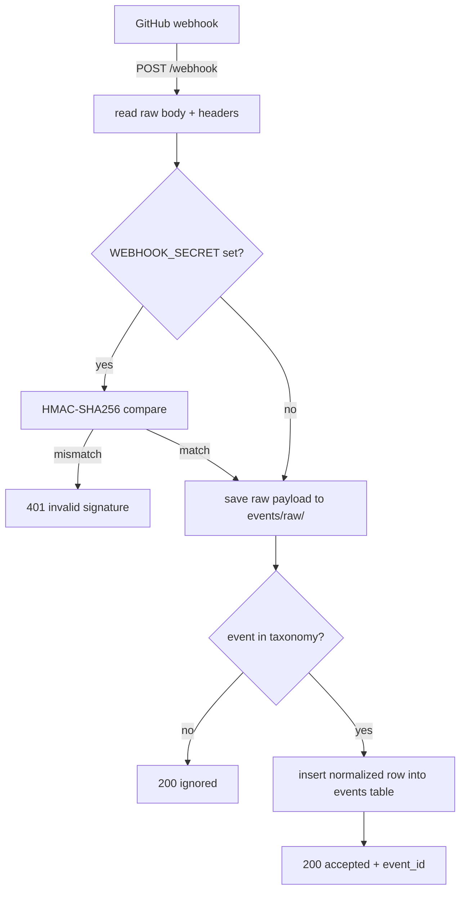

# Intake server

`scripts/intake_server.py` is the Flask webhook receiver that gets GitHub events into the runtime. It is the single HTTP entry point for the outside world: validate the signature, save the raw payload, normalize the event into a controlled taxonomy, insert it into the `events` table, and return. It does not classify, dispatch, or decide anything. It is the mailroom, not the workflow.

## Key source files

| File | Purpose |
|---|---|
| `scripts/intake_server.py` | Flask app: receive, verify, save, normalize, insert. |
| `scripts/init_db.py` | Creates the `events` table the server writes to. |
| `scripts/runtime/heartbeat/runner.py` | Polls the `events` table for rows the intake server produced. |
| `scripts/runtime/return_router.py` | Consumes merged PR events the intake server recorded. |

## Deployment

The server listens on `127.0.0.1:5050` and is meant to be exposed to GitHub via an ngrok tunnel (`ngrok http 5050`) or a reverse proxy, then registered as a webhook target in the repo's webhook settings. In production it runs as a systemd service. It binds loopback only on purpose; the public surface is whatever tunnel or proxy is put in front of it.

At startup it refuses to run if `db/queue.db` is missing and tells you to run `scripts/init_db.py` first. If no webhook secret is resolved, it prints a warning that signature verification is disabled and that the server should not be exposed publicly in that state.

## Request flow

### POST /webhook

The handler does four things in order:

1. **Signature check.** `verify_signature` computes `sha256=` + HMAC-SHA256 of the raw body with the webhook secret and compares it against the `X-Hub-Signature-256` header using `hmac.compare_digest` (constant time). If the secret is unset, verification is skipped and the server logs a warning at startup. A mismatch returns `401` and the request ends there.
2. **Save raw payload.** Regardless of event type, the raw JSON is written to `events/raw/<event_type>_<timestamp>.json` under the runtime state root. This is the audit trail; the runtime never throws away what GitHub sent.
3. **Normalize.** `normalize_event` maps the GitHub event type and action to the runtime's controlled taxonomy. If there is no mapping, the handler returns `200 ignored` and the event is not inserted. Unknown events are not errors; they are deliberately dropped so the runtime only reasons over event types it understands.
4. **Insert.** The normalized event dict is inserted into the `events` table with `status="received"`. The response is `200 accepted` with the new `event_id`.

### GET /health

A simple liveness probe returning `{"status": "ok"}`. Useful for the systemd unit and the tunnel health check.

## Credential resolution

The webhook secret is resolved by `_resolve_webhook_secret` in a two-tier pattern:

1. **Env var first.** If `GITHUB_WEBHOOK_SECRET` is set, use it directly.
2. **Pass password manager fallback.** If the env var is empty, run the command in `GDDP_WEBHOOK_SECRET_CMD` (default `pass show gddp/webhook-secret`) via `subprocess.run` with a 15-second timeout. The command is split with `shlex`, the binary is checked to exist with `shutil.which`, and any failure (missing binary, non-zero exit, timeout) returns an empty string, which disables verification.

This is the same pattern the verification bridge uses for its LLM API keys (`GDDP_DEEPSEEK_KEY_CMD` and friends): the secret never sits in a plaintext env file, and the runtime degrades safely when the password manager is absent. The priority is always env var > pass > disabled, and disabled is loud about it.

## Controlled event taxonomy

`normalize_event` maps a `(github_event, action)` pair to a single runtime event type. The taxonomy is deliberately small:

| GitHub event | action | Runtime type |
|---|---|---|
| `pull_request` | `opened` | `pull_request.opened` |
| `pull_request` | `synchronize` | `pull_request.updated` |
| `pull_request` | `closed` | `pull_request.opened` (may be a merge) |
| `issues` | `opened` | `issue.opened` |
| `issue_comment` | `created` | `issue.commented` |
| `push` | (none) | `push.branch_updated` |
| `check_suite` | `completed` | `workflow.succeeded` |
| `workflow_run` | `completed` | `workflow.succeeded` |
| `workflow_run` | `failed` | `workflow.failed` |

Anything outside this map returns `None` and the event is ignored. The runtime downstream decides what each type means: the heartbeat runner polls for actionable events, the return router picks up merged PRs, and the decision loop may wake on either. The intake server's job is to produce well-typed rows, not to interpret them.

Each normalized row carries: `event_id`, `received_at`, `source` (always `github`), `event_type`, `actor`, `branch`, `base_branch`, `pr_number`, `issue_number`, `commit_sha`, `url`, `repo`, and a set of placeholder fields (`project_id`, `scope_status`, `priority`, `risk_level`, `classification`, `routing`) that downstream stages fill in. `project_id` starts as `null` and is stamped by the heartbeat once it adopts the event by repo. `status` starts as `received`.

## What the intake server does not do

- It does not classify events or match them to nodes.
- It does not dispatch work or wake the decision loop directly.
- It does not call GitHub back. It only receives.
- It does not advance any job or node status.

It writes rows and saves raw payloads. Everything else is a downstream system's job.

## Related pages

- [overview/architecture.md](../overview/architecture.md) — where intake sits in the full system flow.
- [systems/decision-loop.md](decision-loop.md) — the layer that wakes on the events intake records.
- [systems/return-router.md](return-router.md) — consumes the merged PR rows intake produces.
- [systems/state-persistence.md](../systems/state-persistence.md) — the `events` table schema and lifecycle.
- [systems/heartbeat.md](../systems/heartbeat.md) — polls the events table and adopts rows by repo.
