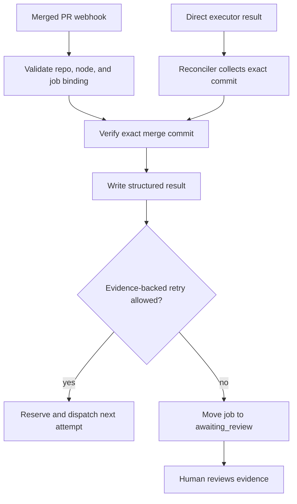

# Return and review

Active contributors: Saboor

## Purpose

Return and review converts executor output into durable, structured evidence and places the matching runtime job in the human review queue. It supports merged PR returns, direct executor commits, replay, repository resolution, and provisional gate tokens. None of these mechanisms completes a graph node.

## Directory layout

| Path | Role |
|---|---|
| `scripts/runtime/return_router.py` | Validates merged PR metadata, invokes verification, writes results, and optionally retries |
| `scripts/runtime/results_store.py` | Persists review and decision rows |
| `scripts/runtime/replay.py` | Operator-confirmed replay from persisted event or job state |
| `scripts/runtime/repo_resolver.py` | Canonical graph repository to local checkout mapping |
| `scripts/runtime/gates.py` | Provisional per-node admission tokens for mission execution |
| `scripts/runtime/heartbeat/reconciler.py` | Direct-session collection and review routing |

## Key abstractions

| Abstraction | Meaning |
|---|---|
| review result | A `results` row carrying executor outcome, evaluator evidence, provenance, risks, and return metadata |
| merged PR metadata block | Exact `node:` and `job:` binding included in executor-created PR bodies |
| retry findings | Evidence-referenced criteria and integrity findings injected into the next attempt |
| repository resolution | Ordered candidate policy based on the graph's declared `repo:` field |
| gate token | Non-lifecycle evidence that a provisional dependency passed evaluation |

## How it works

### Merged PR return

The heartbeat recognizes a merged PR by reading `merged_at` from the archived raw webhook and calls `handle_merged_pr()`.

The router rejects returns unless:

- the repository is in the allowed set;
- the PR body has `node: <node-id>`;
- the PR body has `job: <job-id>`;
- the job exists;
- repository and node match the persisted job.

It then invokes [Verification](verification.md) with the exact merge commit and PR reference. Verification errors are recorded rather than blocking the return path. `write_result()` stores the evaluator dictionary in `acceptance_check` together with merged PR metadata.

The evaluations export is refreshed best-effort after the result lands. Export failures do not suppress the review receipt.

### Retry or review

The router consults `scripts/runtime/verification/retry_budget.py` only after persisting the original result. A retry requires a non-pass outcome, project policy allowance, remaining attempt budget, and concrete evidence references.

When retrying, it builds `previous_findings` from criteria and integrity evidence, atomically increments the job attempt, and inserts a `dispatching` executor-session reservation before calling the adapter. A failed retry dispatch returns the job to human review. A late outcome whose reservation is no longer current is ignored and cancelled when possible.

Without a qualifying retry, both job and queue record move to `awaiting_review`. The evaluator recommendation is not a decision.

### Direct executor return

Direct adapters return through `scripts/runtime/heartbeat/reconciler.py`, not through a PR webhook. The reconciler verifies or reconstructs a commit, writes a durable result ref, evaluates that exact commit, writes a result row, marks the executor session `evaluated`, and moves the job to `awaiting_review`.

Factory mission evidence that is incomplete or quarantined can bypass evaluator execution and go directly to review while retaining its manifest and reasons. See [Factory mission](factory-mission.md).

### Results persistence

`scripts/runtime/results_store.py` upserts review receipts by `result_id`. Structured values are JSON encoded into the canonical `results` table. The same module writes `decision_results`, which records actions such as dispatch, escalation, no-op, and manual runtime state changes without requiring a job foreign key.

### Repository resolution

`scripts/runtime/repo_resolver.py` prevents project IDs from being mistaken for checkout directory names. It reads the graph's `repo:` mapping and tests candidates in order:

1. Explicit caller path.
2. An absolute `repo:` value.
3. `GDDP_REPO_ROOT/<repo-basename>`.
4. `GDDP_REPOS_ROOT/<repo-basename>`.
5. A sibling of the config checkout.

A candidate wins only if it contains a `.git` directory or worktree gitdir file. Callers can expose the complete candidate list in errors.

### Replay

`scripts/runtime/replay.py` operates on persisted state:

- `--result-id` derives the original event and reruns merged PR routing.
- `--job-id` reloads the job and requires the operator to type `yes` before redispatch.

Replay does not repeat webhook intake, classification, or scoping. It is a repair tool, not an alternate scheduler.

### Gate tokens

When qualifying evaluation evidence marks a node provisional, `write_gate()` atomically writes `.gddp/gates/<node-id>.token` in the target checkout. The token includes node ID, issue time, and optional receipt path and digest.

Gate tokens are mission admission evidence, not lifecycle. `read_gate()` requires a matching node ID, and `gate_satisfied()` requires every dependency token. Human rejection or deferral can call `revoke_gate()`. Token-write failure is non-fatal and never changes graph truth.

## Integration points

- [Heartbeat](heartbeat.md) detects merged PRs and reconciles direct sessions.
- [Executor adapters](executor-adapters.md) emit the metadata and return shapes consumed here.
- [Verification](verification.md) produces the evidence attached to each result.
- [Intake and control plane](intake-and-control-plane.md) exposes results and runtime-state actions to the operator.
- `gddp-config` human tooling applies acceptance, rejection, deferral, or graph amendments.

## Entry points for modification

- Change return identity validation in `scripts/runtime/return_router.py`; retain exact job, node, and repo binding.
- Change result fields in `scripts/runtime/results_store.py` and the schema migration together.
- Change checkout policy only in `scripts/runtime/repo_resolver.py` so all callers remain consistent.
- Add replay operations in `scripts/runtime/replay.py` with explicit operator confirmation for dispatch or other consequential work.
- Change gates in `scripts/runtime/gates.py`; keep them evidence-only and atomically written.

## Key source files

| File | Key symbols |
|---|---|
| `scripts/runtime/return_router.py` | `handle_merged_pr`, `_redispatch_with_findings` |
| `scripts/runtime/results_store.py` | `write_result`, `write_decision_result` |
| `scripts/runtime/replay.py` | `replay_result`, `replay_job` |
| `scripts/runtime/repo_resolver.py` | `resolution_candidates`, `resolve_project_repo_checkout` |
| `scripts/runtime/gates.py` | `write_gate`, `read_gate`, `revoke_gate`, `gate_satisfied` |
