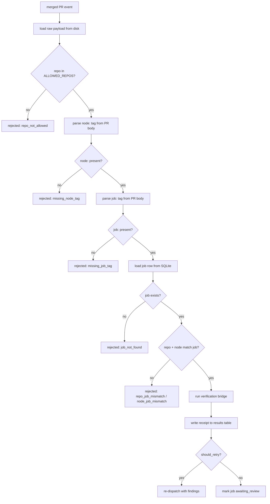

# Return router

Merged PRs do not silently become graph truth. `scripts/runtime/return_router.py` is the single path that turns a merged pull request into a structured review receipt in SQLite, and routes the matching job either to `awaiting_review` for a human or back to the executor with findings attached. The runtime never mutates graph truth on the return path; it produces evidence that a human reviews.

## Key source files

| File | Purpose |
|---|---|
| `scripts/runtime/return_router.py` | Parses PR metadata, validates, runs the verification bridge, writes the receipt, routes the job. |
| `scripts/runtime/results_store.py` | `write_result` persists the receipt row to the `results` table. |
| `scripts/runtime/verification/bridge.py` | `verify_job_return` runs the two-lane evaluator against the returned work. |
| `scripts/runtime/verification/retry_budget.py` | `should_retry` decides whether a non-pass verdict re-dispatches instead of awaiting review. |
| `scripts/runtime/heartbeat/dispatcher.py` | `dispatch` re-opens the GitHub issue with findings when the retry loop fires. |

## How a merged PR becomes a receipt

`handle_merged_pr` is the entry point, called with the normalized event row that represents the merge. The flow is strictly ordered, and a rejection at any step short-circuits with a reason string and no receipt written.

### Tag parsing

The PR body must contain two metadata lines, parsed case-insensitively across multiline input:

- `node: <node_id>` via `parse_node_id`
- `job: <job_id>` via `parse_job_id`

Both are extracted with a `(?mi)^node:\s*(.+)$` style regex. If either is missing, the PR is rejected with `missing_node_tag` or `missing_job_tag` and no receipt is written. The dispatch adapter puts this block into every issue body it creates, so a well-formed Jules return carries it automatically; the router exists to enforce it, not to guess it.

### Repo allowlist

`ALLOWED_REPOS` is a hardcoded list, currently `["skchaudr/vault-doctor", "skchaudr/test-project"]`. `validate_repo` rejects any PR whose `repository.full_name` is not on the list with `repo_not_allowed`. This is a deliberate chokepoint: the return router only acts on repos the runtime is explicitly configured to oversee, so a stray webhook from an unrelated repo cannot create a receipt.

This is a known limit. Adding a project means editing the source, not a config file. The list is small and changes rarely, but it is the kind of thing that should move to `gddp-config` once the runtime grows a per-project registry.

### Job load and cross-check

`_load_job` reads the job row by `job_id`. Two cross-checks follow:

1. `job["repo"]` must equal the PR's `repo_name`, else `repo_job_mismatch`.
2. `job["node_id"]` must equal the parsed `node_id`, else `node_job_mismatch`.

These guards prevent a PR from one project claiming credit for a job in another, or a node tag that does not match the job's actual node. The job, not the PR body, is the source of truth for what work was dispatched.

### Verification bridge

With the job validated, the router calls `verify_job_return(job["project_id"], node_id)`. This runs the two-lane evaluator (see [systems/verification.md](../systems/verification.md)) and returns a verdict dict. The verdict is evidence, not graph truth: the router records it and routes accordingly, but it never advances node status on its own.

### Receipt write

`write_result` persists a row to the `results` table with:

- `result_id` derived from the event id (`res_<event_id suffix>`)
- `job_id`, `executor`, `outcome="success"`, `status="needs_review"`
- `received_at` set to the PR's `merged_at` timestamp
- `acceptance_check` holding the full verification dict
- `github_action` capturing source repo, PR number, merged URL, node id, and `review_required: True`

The receipt is the artifact the human reviewer reads. It is structured, queryable, and the only record that the merge happened in the runtime's eyes.

### Routing: awaiting_review or re-dispatch

After the receipt is written, the router consults `should_retry` from `scripts/runtime/verification/retry_budget.py`. The decision weighs the verdict, the integrity lane's verdict, the job's attempt count, and the project YAML's retry budget.

- **No retry:** `_mark_job_awaiting_review` flips the job's `status` and `queue_state` to `awaiting_review` and moves the corresponding `queue_records` row into the `awaiting_review` queue. The job now sits at the human review gate.
- **Retry:** `_redispatch_with_findings` increments the job's `attempt`, packages the previous verdict's findings into a `_previous_findings` field on the job dict, and calls `dispatch` to re-open the issue with the findings in the body. The executor gets a second chance with concrete, evidence-referenced feedback. See [features/retry-loop.md](../features/retry-loop.md).

If the re-dispatch itself fails (gh CLI error, timeout), the router falls back to `awaiting_review` rather than leaving the job unattended. The receipt and findings are already on disk; the human can inspect and re-dispatch manually. A job never sits in limbo because the retry path errored.

## What the router does not do

- It does not advance node status to `complete`. That is the human's call, via an evidence PR merged into `gddp-config`.
- It does not write to the project graph.
- It does not retry on its own beyond the budget. Once `should_retry` returns false, the human is the next gate.

## Related pages

- [overview/architecture.md](../overview/architecture.md) — where the return router sits in the full system flow.
- [systems/verification.md](../systems/verification.md) — the evaluator the router invokes.
- [systems/decision-loop.md](decision-loop.md) — the layer that wakes on webhooks and cron and may trigger return routing.
- [systems/intake-server.md](intake-server.md) — the Flask receiver that gets the merged PR webhook into SQLite in the first place.
- [features/receipt-based-return.md](../features/receipt-based-return.md) — the receipt as the canonical return artifact.
- [features/retry-loop.md](../features/retry-loop.md) — how the retry budget gates re-dispatch.
