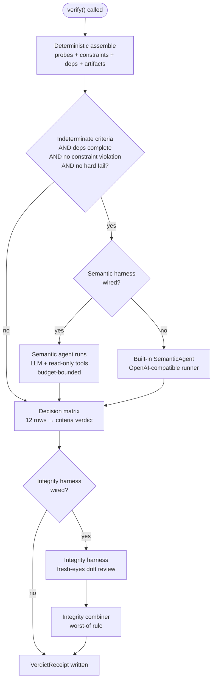

# Verification

The evaluator is the second-to-last gate before human review. It takes a node's acceptance criteria, the project graph, and a repo checkout, then produces a `VerdictReceipt` that the return router attaches to the review. The receipt is evidence, not graph truth. Only a human accepts a node.

The evaluator has two lanes. Lane 1 adjudicates acceptance criteria: deterministic probes run first, and any criteria they cannot resolve get escalated to a budget-bounded LLM agent that investigates the repo with read-only tools. A 12-row decision matrix combines the two into a criteria verdict. Lane 2 is a fresh-eyes integrity review that asks whether the work preserves the node's intended role in the project graph. The integrity combiner takes the worst-of the two lanes: integrity can only worsen the final verdict, never upgrade it.

## Deterministic probes

Lane 1 starts with a deterministic floor assembled by `scripts/runtime/verification/deterministic/__init__.py`. The `assemble()` function runs four families of checks and packs them into a `DeterministicResult`:

| Check family | Source | What it does |
|---|---|---|
| Acceptance criteria | `scripts/runtime/verification/deterministic/probes.py` | Evaluates each criterion in the node's `acceptance_criteria` list against the repo. |
| Constraints | `scripts/runtime/verification/deterministic/constraints.py` | Scans referenced lib files for forbidden patterns (executor-specific sourcing, runtime deps in zsh). |
| Dependencies | `scripts/runtime/verification/deterministic/deps.py` | Reads each `depends_on` node's status from the project graph index. |
| Artifacts | `scripts/runtime/verification/deterministic/artifacts.py` | Checks whether each entry in `required_artifacts` exists in the repo. |

### Criterion probe types

`probes.py` evaluates each acceptance criterion through a dispatch table keyed by probe type. The `CHECK_PROBES` dict registers explicit probes by criterion id, with node-specific overrides taking priority (`{node_id}:{criterion_id}` before bare `{criterion_id}`). When no explicit probe is registered, a fallback keyword scan extracts identifiers from the criterion text and greps candidate source files.

The probe types:

- **`command_proof`** — if the criterion dict carries a `command` field, it runs that command in the repo via `subprocess` and passes on exit 0, fails on non-zero. Timeouts and OS errors produce indeterminate, not fail.
- **`symbol`** / **`any_of`** — greps one or more files for regex patterns. `symbol` with `"all": true` requires every pattern to match; `any_of` needs at least one. Missing files downgrade confidence and record a `source_path` mismatch.
- **`func`** — looks for a named function definition (`\bname\s*\(`) plus body marker patterns in the same files. Confirms the function exists and uses expected helpers.
- **`path`** — checks a single path exists, optionally grepping it for marker patterns. Absent paths with `needs_evidence_when_absent` flag the criterion as needing evidence.
- **`paths`** — checks a list of paths all exist. Hard pass or hard fail.
- **`tier_distinct`** — parses a `targets.conf` file and checks that named tiers resolve to distinct commands, that required tiers are present, and that aliases resolve to the same command as the canonical target. Surfaces `tier_distinct` and `alias_integration` mismatches specifically rather than flattening to pass/fail.
- **`project_policy`** — greps a project-level policy file (resolved against `config_root`, not the repo) for required markers.
- **`human_review`** — always returns indeterminate with a human question. Used for criteria that cannot be machine-resolved.

The fallback path deserves attention. When no probe is registered and the criterion text names source paths, those paths are checked for existence. Named-but-missing paths produce indeterminate with a `source_path` mismatch and a human question. If the text yields no usable identifiers, the criterion is indeterminate at confidence 0.1. The fallback keyword scan is deliberately weak: finding strings in files does not prove a criterion is satisfied, so it always returns indeterminate and lets the semantic agent judge.

### Constraint scanning

`constraints.py` collects the files scoped by the node's acceptance criteria probes plus any source paths mentioned in the constraint text, then scans `lib/*.zsh` files for two forbidden patterns: sourcing an executor-specific module from a common-layer file, and introducing a Python runtime dependency in a zsh lib. A constraint is `violated` if any pattern matches, `clear` otherwise.

### Dependency and artifact checks

`deps.py` is a one-function module: it reads the project graph's node index and returns `{dep_id: status}` for each `depends_on` entry. Missing nodes report `unknown`.

`artifacts.py` checks each entry in `required_artifacts` at three locations: repo root, `.gddp/`, and `docs/`. The `merged_pr` artifact is special-cased to always report not-present, since confirming a merge needs network access the harness does not have.

## Semantic agent

The semantic agent only fires when the deterministic floor has indeterminate criteria, dependencies are complete, no constraints are violated, and no criteria hard-failed. This gate lives in `_should_run_semantic()` in `scripts/runtime/verification/orchestrator.py`. The logic: deterministic failures and blockers are already decisive, so spending LLM budget on them would be waste.

The agent is a tool-calling loop implemented in `scripts/runtime/verification/semantic/agent.py`. It sends the node, graph, deterministic result, and optional shape profile to an LLM, then iterates: the model calls evidence tools, the harness executes them and feeds results back, and the loop continues until the model calls `submit_verdict` or a budget limit forces graceful finalization.

### Budget bounds

The `SemanticAgent` dataclass carries four budget knobs:

| Budget | Default | What it limits |
|---|---|---|
| `max_turns` | 15 | Round-trips with the LLM. |
| `max_tool_calls` | 40 | Evidence tool invocations across the whole run. |
| `max_tokens` | 24,000 (offline) / 96,000 (live) | Estimated total transcript tokens, enforced with a conservative chars/4 heuristic. |
| `max_tool_result_chars` | 50,000 | Characters from a single tool result before truncation. |

When the agent approaches any limit, it injects a finalization prompt telling the model to stop tool use and call `submit_verdict` with whatever evidence it has, marking uncertain criteria indeterminate. If the model still does not submit, the loop ends with a `budget_exhausted` `SemanticOutput` containing empty judgments. The receipt's `completeness_status` field records this: `complete` when the agent produced judgments without exhausting budget, `partial` when budget ran out or no judgments were returned, `not-run` when the semantic lane never fired.

Every budget event is traced. The `budget_trace` dict on `SemanticOutput` records the initial budget, each model response and tool result with estimated token costs, and the final reason the loop stopped. This is debuggable evidence, not just a flag.

### The submit_verdict contract

The only terminal path for the semantic agent is the `submit_verdict` tool. Its arguments must validate against `SemanticOutput`: a list of `CriterionJudgment` objects (each with `criterion_id`, `judgment` of `judged_pass`/`judged_fail`/`indeterminate`, `confidence` in 0-1, evidence list, and reasoning), plus `overall_reasoning`, `risks`, `followup_candidates`, and `budget_exhausted`. If the model submits a malformed payload, the harness sends a validation error back and lets it retry up to `max_validation_retries` times (default 2). After that, the run finalizes as budget-exhausted.

The agent also handles the case where the model produces a terminal text response (finish reason `stop`/`end_turn`) instead of a tool call. It attempts to parse the content as `SemanticOutput` JSON, and if that fails, asks the model to call `submit_verdict` properly.

### Read-only tools

The semantic agent's tools live in `scripts/runtime/verification/semantic/tools.py`. The `SemanticToolbox` enforces a read-only contract through several layers:

- **Path confinement.** Every file and directory operation resolves the target against `repo_root` and rejects paths that escape it.
- **Command allowlist.** `run_command` only accepts prefixes in `ALLOWED_COMMAND_PREFIXES`: `git diff/log/show/status/grep`, `pytest`, `python3`, `python`. A joined-string check blocks `WRITE_TOKENS` (redirects, `rm`, `mv`, `git commit/push/reset/checkout/merge/rebase/clean/add`, `sed`, `perl`, `tee`, `touch`, `mkdir`) and `NETWORK_TOKENS` (`curl`, `wget`, `ssh`, `pip`, `npm`, `brew`, etc.).
- **Network-disabled environment.** Subprocesses run with `NO_PROXY=*`, `PIP_NO_INDEX=1`, `GIT_CONFIG_NOSYSTEM=1`, `GIT_TERMINAL_PROMPT=0`.
- **No write tools.** The tool schemas expose `read_file`, `list_directory`, `grep_code`, `run_command`, `read_node_yaml`, `read_project_yaml`, `git_diff`, `git_log`, and `submit_verdict`. There is no edit, write, or multi-edit tool.

Python and pytest are allowed as evidence tools because the harness runs trusted models against the operator's own repos with the network disabled. Running tests and scripts is legitimate evaluation work; installing packages or mutating state is not.

### Offline vs. live runners

The CLI supports two semantic modes. In `offline` mode (the default), an `OfflineFinalizingRunner` produces no network calls. It reads the deterministic result from the prompt context and finalizes every indeterminate criterion as `indeterminate` at confidence capped at 0.2, with `budget_exhausted: true`. This produces an honest receipt: the verifier ran, but a model did not resolve semantic meaning.

In `live` mode, the CLI builds an `OpenAICompatibleRunner` using stdlib `urllib` (no SDK dependency) against a DeepSeek or GLM endpoint. Provider selection prefers DeepSeek when `DEEPSEEK_API_KEY` is set, then GLM. The `--semantic-harness` flag selects between the built-in `runner` loop and a `pi` harness that drives the pi coding agent as the LLM backend with streaming, visible output.

## The 12-row decision matrix

`scripts/runtime/verification/decision_engine.py` is a pure function. `decide()` takes a `DeterministicResult` and an optional `SemanticOutput`, walks a list of 12 `_MatrixRow` entries in order, and returns the first match as `(verdict, confidence, required_next_action)`. No I/O, no LLM, no side effects.

The rows are evaluated top-down, so earlier rows take priority. This ordering encodes the evaluator's precedence: blocking conditions before failures, failures before evidence gaps, evidence gaps before human review, human review before pass.

| Row | Condition | Verdict | Confidence basis | Next action |
|---|---|---|---|---|
| 1 | Dependencies incomplete | `blocked` | 1.0 (constant) | Complete dependency nodes before re-verification |
| 2 | Constraint violated | `out-of-scope-change-detected` | Mean of violated constraint confidences | Revert out-of-scope changes and re-submit |
| 3 | Any deterministic hard fail | `fail` | Mean of fail-criterion confidences | Fix failing acceptance criteria and re-submit |
| 4 | Indeterminate-only, any semantic `judged_fail` | `fail` | Semantic blend of judged-fail judgments | Address semantic failures and re-submit |
| 5 | All deterministic pass, artifacts missing | `needs-more-evidence` | Mean of all criterion confidences | Provide missing required artifacts and re-submit |
| 6 | Indeterminate-only, all semantic `judged_pass`, artifacts missing | `needs-more-evidence` | Semantic blend of all judgments | Provide missing required artifacts and re-submit |
| 7 | Indeterminate-only, any semantic indeterminate, artifacts missing, budget not exhausted | `needs-more-evidence` | Semantic blend of indeterminate judgments | Provide missing artifacts and re-run semantic investigation |
| 8 | Indeterminate-only, budget exhausted | `needs-more-evidence` | Semantic blend, capped at 0.5 | Re-run semantic investigation with sufficient budget |
| 9 | Indeterminate-only, no judgments produced | `needs-more-evidence` | Deterministic floor confidence | Re-run semantic investigation to produce judgments |
| 10 | Indeterminate-only, any semantic indeterminate, artifacts present | `needs-human-review` | Semantic blend of indeterminate judgments | Human review required for unresolved semantic judgments |
| 11 | Indeterminate-only, all semantic `judged_pass`, artifacts present | `pass` | Semantic blend of all judgments | Proceed to accept_node (open evidence PR) |
| 12 | All deterministic pass, artifacts present | `pass` | Mean of all criterion confidences | Proceed to accept_node (open evidence PR) |

### Confidence calculation

Confidence is not a single formula. Each row carries its own confidence function:

- **Row 1** returns a constant 1.0. A blocked node is blocked with certainty.
- **Rows 2-3, 5, 12** use the mean of relevant deterministic check confidences.
- **Rows 4, 6-11** use `_confidence_semantic_blend`, which takes the deterministic floor (mean of indeterminate criterion confidences, or all criteria if none are indeterminate) and blends it with the semantic judgments' satisfaction confidence. When the deterministic result is indeterminate-only, the semantic confidence replaces the floor. Otherwise the blend is `min(floor, semantic)` so the weaker lane dominates.
- **Row 8** caps the blend at 0.5, reflecting that a budget-exhausted run is weak evidence.

Semantic satisfaction confidence per judgment is: `judgment.confidence` for `judged_pass`, `1.0 - judgment.confidence` for `judged_fail`, and `min(confidence, 1.0 - confidence)` for `indeterminate`. This means a high-confidence `judged_fail` contributes low satisfaction, and an `indeterminate` at 0.5 confidence contributes 0.5 satisfaction (maximum uncertainty).

## Integrity combiner

The 12-row matrix produces a criteria verdict. Lane 2 runs after it. The orchestrator calls the integrity harness (if wired), gets an `IntegrityOutput`, and passes both to `scripts/runtime/verification/integrity_combiner.py`.

The combiner is deliberately small. The trust anchor between the two lanes never moves into model judgment. The rules:

| Integrity verdict | Floor | Effect on criteria verdict |
|---|---|---|
| Not run (`None`) | — | Criteria verdict unchanged |
| `pass`, both flags true | `pass` | Criteria verdict unchanged |
| `insufficient` | `needs-more-evidence` | At least needs-more-evidence |
| `unknown` | `needs-human-review` | At least needs-human-review |
| `drift` | `needs-human-review` | At least needs-human-review |
| `contradicted` | `needs-human-review` | At least needs-human-review |
| `block` | `needs-human-review` | At least needs-human-review |

The two flags on `IntegrityOutput` are `intent_preserved` and `graph_integrity_preserved`. If either is false, the floor is forced to at least `needs-human-review` regardless of the verdict word. This catches malformed submissions where the model says "pass" but flags a problem: the flags are the finding, the verdict word does not override them.

The combination is `max(criteria_verdict, floor)` using a severity ordering where `pass` < `needs-more-evidence` < `needs-human-review` < `out-of-scope-change-detected` < `fail` < `blocked`. Neither lane can upgrade the other. If the combined verdict differs from the criteria verdict, the combiner rewrites `required_next_action` to explain that the integrity verdict halts progression and no dependent node may dispatch on this node.

### Integrity harness

When `--integrity on` is passed, the CLI wires an `IntegrityHarnessRunner` from `scripts/runtime/verification/semantic/integrity_runner.py`. This spawns `pi --print` with a TypeScript extension (`gddp_integrity.ts`) that registers a `submit_integrity_verdict` tool, plus a guard extension (`gddp_verifier_guard.ts`) that hard-blocks edit/write/multi_edit tools. The integrity reviewer gets a different system prompt than the semantic agent: its mandate is fresh-eyes drift review, not criteria adjudication. It receives the node YAML, project graph, deterministic result, and pointers (not contents) to depends_on/unlocks neighbor node files. Pointers, not embedded blobs, because a read call is evidence and an embedded blob is not.

The integrity vocabulary (`pass`, `block`, `drift`, `insufficient`, `contradicted`, `unknown`) comes from the evaluator-intent-integrity-verdict node in gddp-config, not from this repo. The graph is the source of the language.

If the pi process exits without calling `submit_integrity_verdict`, the runner returns an `unknown` verdict with `required_human_review: true` and zero confidence.

## Bridge: verification as a subprocess

`scripts/runtime/verification/bridge.py` is the glue between the return router and the verifier. When a job's merged PR comes back, `verify_job_return()` runs the same verification CLI a human would run and attaches the receipt summary to the review result.

The bridge runs the CLI as a subprocess, not in-process. This is a deliberate isolation boundary: an evaluator crash, hang, or timeout cannot take down the return router. The timeout defaults to 1500 seconds (configurable via `GDDP_VERIFY_TIMEOUT_SECONDS`).

`verify_job_return()` always returns a dict, never raises. On success it returns `{"verification_status": "ok", "receipt_path", "verdict", "criteria_confidence", "required_next_action"}` plus `criteria_verdict` and `integrity` when present. On failure it returns `{"verification_status": "error", "error": ...}`. Transient failures (timeout, crash, garbled output) get exactly one retry; missing config or repo paths do not, because those need a human, not a rerun.

The bridge flips the integrity lane on by default (`--integrity on`) for live runs. The whole point of the return path is that every merged PR gets a fresh-eyes integrity review, including deterministic clean passes. A green row-12 run does not bypass lane 2. Developers can override with `GDDP_INTEGRITY_MODE=off` for dev/test runs.

The bridge also handles credential bootstrapping. The evaluator pi runs with a sandboxed HOME (no `~/.pi/agent/models.json`), so it can only resolve the DeepSeek key from the environment. When `DEEPSEEK_API_KEY` is missing, the bridge attempts to fetch it from an external source (default: `pass show api/deepseek`, configurable via `GDDP_DEEPSEEK_KEY_CMD`). This is best-effort: if the fetch fails, the verifier's own error surfaces in the error record.

The CLI's stdout may contain pi streaming output before the final JSON summary. The bridge walks backward through stdout lines to find the last line that starts with `{` and parses from there.

## CLI entry point

`scripts/runtime/verification/cli.py` is the human-runnable entry point. It parses arguments, loads the node and project YAML, builds the runner and toolbox, calls `verify()`, writes the receipt via `receipt_sink.py`, and prints a JSON summary.

Key flags:

| Flag | Default | Purpose |
|---|---|---|
| `--node-yaml` | required | Path to the node YAML file |
| `--project-yaml` | required | Path to the project YAML file |
| `--repo` | required | Path to the source repo to verify |
| `--config-root` | optional | Path to gddp-config root for project_policy probes |
| `--receipt-dir` | optional | Directory for the JSON receipt |
| `--semantic-mode` | `offline` | `offline` (network-free) or `live` (LLM endpoint) |
| `--semantic-provider` | `auto` | `auto`, `deepseek`, or `glm` |
| `--semantic-harness` | `auto` | `auto` (resolves to `runner`), `pi`, or `runner` |
| `--semantic-max-turns` | 15 | Max LLM round-trips |
| `--semantic-max-tool-calls` | 40 | Max evidence tool calls |
| `--integrity` | `off` | `on` or `off`; bridge flips this on for live runs |

The receipt is written by `scripts/runtime/verification/receipt_sink.py` to `{receipt_dir}/{project_id}/{node_id}.json`. The `VerdictReceipt` model in `schemas.py` carries both the combined verdict and the criteria verdict (the matrix's own answer before integrity combination), along with the full `IntegrityOutput` when lane 2 ran. A `model_validator` backfills `criteria_confidence` from legacy `confidence` and infers `completeness_status` from the semantic output, so older receipt JSON still loads.

## Receipt structure

`VerdictReceipt` (defined in `scripts/runtime/verification/schemas.py`) is the output contract. It carries:

- `verdict` — the combined two-lane verdict
- `criteria_verdict` — the matrix verdict before integrity combination
- `integrity` — the full `IntegrityOutput` when lane 2 ran, `None` otherwise
- `criteria_confidence` — the matrix confidence
- `completeness_status` — `complete`, `partial`, or `not-run`
- `deterministic` — the full `DeterministicResult` (criteria, constraints, artifacts, deps, mismatches, missing evidence, human review questions)
- `semantic` — the full `SemanticOutput` when the semantic agent ran
- `decision_reasoning` and `required_next_action` — human-readable guidance

The receipt is the evidence the human reviewer sees. The verdict is not graph truth. For more on how receipts flow back into the runtime, see [Receipt-based return flow](../features/receipt-based-return.md) and [Receipt-only merged-PR return handling](../systems/return-router.md). For the retry loop that can re-dispatch a failed node with findings injected, see [Evaluator-to-executor retry budget](../features/retry-loop.md).

## Key source files

| File | Role |
|---|---|
| `scripts/runtime/verification/orchestrator.py` | Top-level `verify()` function; assembles deterministic, conditionally runs semantic and integrity, produces `VerdictReceipt` |
| `scripts/runtime/verification/decision_engine.py` | Pure 12-row decision matrix; deterministic + semantic → criteria verdict |
| `scripts/runtime/verification/integrity_combiner.py` | Worst-of combiner; criteria verdict + integrity → combined verdict |
| `scripts/runtime/verification/schemas.py` | All dataclasses and Pydantic models: `Verdict`, `CriterionCheck`, `DeterministicResult`, `SemanticOutput`, `IntegrityOutput`, `VerdictReceipt` |
| `scripts/runtime/verification/bridge.py` | Subprocess invocation on the return path; retry-once for transient failures |
| `scripts/runtime/verification/cli.py` | CLI entry point; argument parsing, runner/harness selection, receipt writing |
| `scripts/runtime/verification/deterministic/__init__.py` | `assemble()` — runs all four deterministic check families |
| `scripts/runtime/verification/deterministic/probes.py` | Criterion evaluation: probe dispatch, fallback keyword scan, tier parsing |
| `scripts/runtime/verification/deterministic/constraints.py` | Forbidden-pattern scan over lib files |
| `scripts/runtime/verification/deterministic/deps.py` | Dependency status from project graph index |
| `scripts/runtime/verification/deterministic/artifacts.py` | Required-artifact presence checks |
| `scripts/runtime/verification/semantic/agent.py` | Budget-bounded tool-calling loop; `submit_verdict` contract; budget tracing |
| `scripts/runtime/verification/semantic/tools.py` | Read-only `SemanticToolbox`; path confinement, command allowlist, network-disabled env |
| `scripts/runtime/verification/semantic/integrity_runner.py` | Pi-harness runner for lane 2; fresh-eyes drift review with neighbor pointers |
| `scripts/runtime/verification/semantic/prompt.py` | System prompt and prompt-message builder for the semantic agent |
| `scripts/runtime/verification/receipt_sink.py` | Receipt path resolution and JSON writing |
| `scripts/runtime/verification/retry_budget.py` | Heuristic for whether a non-pass verdict with evidence references should trigger an executor retry |

## Related pages

- [System architecture](../overview/architecture.md) — where verification sits in the full runtime flow
- [Receipt-only merged-PR return handling](../systems/return-router.md) — how the return router calls the bridge and routes on verdict
- [Evaluator-to-executor retry budget](../features/retry-loop.md) — when a non-pass verdict re-dispatches instead of awaiting review
- [Receipt-based return flow](../features/receipt-based-return.md) — the receipt pattern that verification produces
- [Core invariants and coding conventions](../how-to-contribute/patterns-and-conventions.md) — the worst-of rule, subprocess isolation, and read-only tools as project invariants
