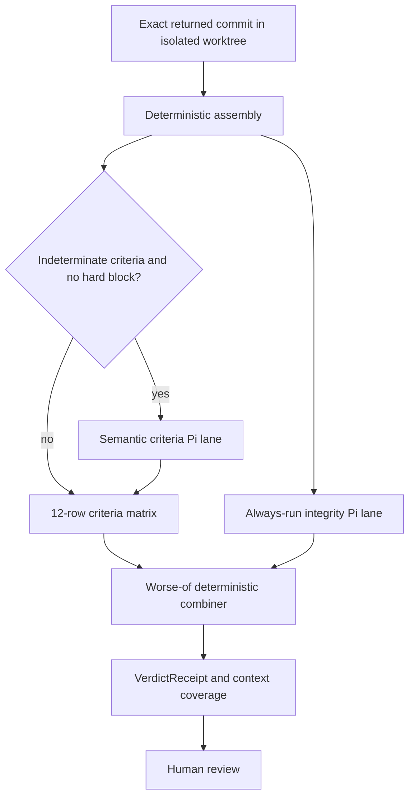

# Verification

Active contributors: Saboor

## Purpose

Verification produces evidence about a returned node attempt through two independent lanes:

1. A criteria lane composed of deterministic checks plus semantic adjudication where deterministic evidence is indeterminate.
2. An always-run intent and graph-integrity lane with a fresh-eyes mandate.

A small deterministic combiner selects the worse outcome. The receipt informs human review and provisional scheduling; it does not complete a node.

## Directory layout

| Path | Role |
|---|---|
| `scripts/runtime/verification/orchestrator.py` | Runs lanes, combines verdicts, computes coverage, builds the receipt |
| `scripts/runtime/verification/deterministic/` | Criteria probes, artifact checks, dependency checks, constraint scans, subject diff |
| `scripts/runtime/verification/semantic/pi_runner.py` | Read-only Pi harness for semantic criteria investigation |
| `scripts/runtime/verification/semantic/integrity_runner.py` | Read-only Pi harness for intent and graph-integrity review |
| `scripts/runtime/verification/decision_engine.py` | Pure 12-row criteria decision matrix |
| `scripts/runtime/verification/integrity_combiner.py` | Worse-of authority boundary between lanes |
| `scripts/runtime/verification/schemas.py` | Typed checks, lane outputs, coverage, and `VerdictReceipt` |
| `scripts/runtime/verification/bridge.py` | Isolated-worktree subprocess bridge from runtime returns |
| `scripts/runtime/verification/receipt_sink.py` | Attempt-preserving receipt paths and writes |

## Key abstractions

| Abstraction | Meaning |
|---|---|
| `DeterministicResult` | Criterion checks, constraint checks, artifacts, dependency states, mismatches, missing evidence, and neutral subject diff |
| `SemanticOutput` | Typed per-criterion judgments, reasoning, risks, follow-ups, budget state, and tool trace |
| `IntegrityOutput` | Intent and graph-integrity flags, verdict, current findings, forward-looking observations, and tool trace |
| `VerificationSignals` | Criteria confidence, completeness, and graph readiness |
| `VerdictReceipt` | Combined verdict with both lane outputs, provenance, canonical context, and coverage |
| `LaneExecutionStatus` | `completed`, `no-verdict`, `crashed`, or `timed-out` harness state |

## How it works

### Return bridge and subject pinning

`verify_job_return()` is the runtime entry point. It resolves node and project YAML from `gddp-config`, resolves the target checkout through the graph's `repo:` field, and requires `merge_commit_sha`. The bridge fetches origin and creates a detached isolated worktree at that exact commit.

The verifier CLI runs as a subprocess so a crash, timeout, malformed result, or model failure cannot take down the [Heartbeat](heartbeat.md) or merged PR router. Transient failures receive one retry. Missing graph files, unresolved repositories, and subject mismatches do not retry because they require operator correction.

The bridge passes the expected base, PR ref, job and attempt identity, evidence-manifest digest, and mission receipt identity into receipt provenance. It parses the CLI's final JSON summary after any streamed Pi output.

### Deterministic floor

`deterministic.assemble()` evaluates every acceptance criterion and constraint, required artifacts, and dependency status. Explicit criterion commands run in the target checkout with a timeout. Registered probes check known symbols, functions, paths, config relationships, or project policy. Generic path and keyword probes remain conservative: weak string evidence is `indeterminate`, not a guessed pass.

Constraint scanning operates on criterion- and constraint-referenced files. Dependency statuses `complete` and `provisional` both satisfy the evaluation edge. Artifact presence contributes completeness separately from criteria confidence.

When an expected base is available, the deterministic lane records a neutral `base..HEAD` name-status diff. It reports touched files without deciding whether broader scope is good or bad.

### Criteria semantic lane

Semantic adjudication runs only when at least one deterministic criterion is `indeterminate` and there is no incomplete dependency, violated constraint, or deterministic criterion failure. The live orchestrator requires an explicit Pi harness; it does not silently fall back to the older built-in agent loop.

`PiHarnessRunner` launches Pi with a clean temporary home, no project context files, no skills, no session persistence, and two explicit extensions. Read, grep, find, ls, and guarded read-only shell are available. Edit, write, dangerous shell, git mutation, and network are blocked mechanically.

The model must terminate through a typed `submit_verdict` tool. Failure to submit, process crash, or timeout returns a partial `SemanticOutput` with typed lane status and preserved log paths. Ground-truth tool traces replace model-reported traces.

The semantic lane judges only stated criteria. Unlisted tests or observations can become follow-up questions but cannot rewrite the definition of success.

### Criteria decision matrix

`decision_engine.decide()` is pure and ordered. Its major outcomes are:

- Incomplete dependencies produce `blocked`.
- Constraint violations produce `out-of-scope-change-detected`.
- Deterministic or semantic failures produce `fail`.
- Missing required artifacts produce `needs-more-evidence`.
- Budget exhaustion or no semantic judgments produce `needs-more-evidence`.
- Remaining semantic indeterminacy with artifacts present produces `needs-human-review`.
- Clean deterministic or semantically adjudicated criteria produce `pass`.

Criteria confidence, evidence completeness, and graph readiness are distinct signals. Missing artifacts lower completeness but do not lower confidence that code satisfies a criterion.

### Intent and integrity lane

The integrity lane runs whenever an integrity harness is configured, including when deterministic criteria are entirely green. `IntegrityHarnessRunner` gets the same canonical context menu as the criteria lane: README, PROJECT-BRIEF, foundational node, and dependency and unlock neighbors.

Its mandate is not to repeat criteria adjudication. It asks whether the implementation preserves the node's intended project role and graph structure. Current-node problems go in `findings` and affect the verdict. Forward-looking graph concerns go in `graph_observations` and remain operator-visible without changing the current verdict.

An absent verdict, crash, or timeout degrades to `unknown`, both preservation flags false, and required human review true.

### Combination

`integrity_combiner.combine()` is the narrow authority boundary:

- A valid integrity pass leaves the criteria verdict unchanged.
- `insufficient` floors the result at `needs-more-evidence`.
- `unknown`, `drift`, `contradicted`, or `block` floor it at `needs-human-review`.
- A nominal integrity pass with either preservation flag false is treated as malformed and also floors to human review.
- Neither lane can upgrade the other.

The combined verdict is the worse result under the fixed severity ordering.

### Receipt and coverage

The receipt preserves both `criteria_verdict` and combined `verdict`, lane outputs, signals, exact evaluated tree and commit, merge subject, expected base, execution identity, and mission provenance.

Canonical context coverage is computed from successful read and grep traces. Each lane is rated `none`, `low`, `medium`, or `high` based on accessed canonical docs and graph neighbors. Overall coverage is the worse rating among lanes that ran. Coverage is review evidence, not an automatic permission check.

Attempt-specific writes use `<project>/<node>/<job>-attempt<N>.json`; reruns receive a suffix instead of overwriting immutable attempt evidence.

## Integration points

- [Heartbeat](heartbeat.md) queues direct-return commits for evaluation and persists results as `awaiting_review`.
- [Factory mission](factory-mission.md) supplies evidence manifest and receipt provenance.
- [Return and review](return-and-review.md) invokes the same bridge for merged PRs.
- `scripts/runtime/heartbeat/provisional_gate.py` may mark a passing, integrity-preserving, non-human-gated node `provisional`. It never writes `complete`.
- [Intake and control plane](intake-and-control-plane.md) exposes receipts and lane output through `gddp jobs`.

## Entry points for modification

- Add deterministic evidence in `scripts/runtime/verification/deterministic/`; prefer explicit, conservative probes.
- Change criteria outcomes only in `scripts/runtime/verification/decision_engine.py` and update its matrix tests.
- Change lane combination only in `scripts/runtime/verification/integrity_combiner.py`; preserve no-upgrade semantics.
- Change evaluator context or read-only controls in the Pi runners and guard extensions, not by trusting prompt text alone.
- Add receipt fields in `scripts/runtime/verification/schemas.py` with backward-compatible validation.
- Preserve exact commit pinning and isolated worktrees in `scripts/runtime/verification/bridge.py`.

## Key source files

| File | Key symbols |
|---|---|
| `scripts/runtime/verification/orchestrator.py` | `verify`, `_compute_context_coverage` |
| `scripts/runtime/verification/deterministic/__init__.py` | `assemble` |
| `scripts/runtime/verification/decision_engine.py` | `MATRIX`, `decide`, `VerificationSignals` |
| `scripts/runtime/verification/integrity_combiner.py` | `combine` |
| `scripts/runtime/verification/semantic/pi_runner.py` | `PiHarnessRunner` |
| `scripts/runtime/verification/semantic/integrity_runner.py` | `IntegrityHarnessRunner` |
| `scripts/runtime/verification/bridge.py` | `verify_job_return` |
| `scripts/runtime/verification/schemas.py` | `VerdictReceipt`, `SemanticOutput`, `IntegrityOutput` |
